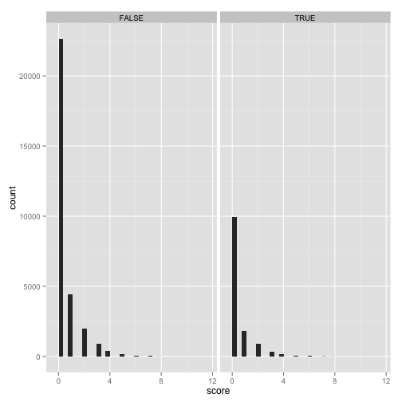

三者凡退の後の援護
========================================================


三者凡退でリズムよく終わらせることに意味はあるのでしょうかね. 

ちょっと確認してみましょう.

以下, 三者凡退を, "3人連続凡退で攻撃終了"とします. 

ランナーを出してからのゲッツーはダメです. 三者が凡退して三者凡退ですからね.  

# データ

データの読み込み. 2013年のメジャーリーグのデータを利用します. 

```r
library(data.table)
library(dplyr)

dat = fread("../../../../data/all2013.csv")
```

```
## 
Read 99.5% of 190907 rows
Read 190907 rows and 97 (of 97) columns from 0.076 GB file in 00:00:03
```

```r
name = fread("../names.csv", header =FALSE)

dat %>% setnames(unlist(name))
```

# 集計
各試合位, 各イニングごとに, 打席に立った打者と,得点を集計します. 


まずは, イニング別得点.

```r
## 得点推移からイニングスコア計算する用のdiff
diff0 = function(x){
  return(diff(c(0,x)))
}

dat_inningscore = 
  dat %>% 
  group_by(GAME_ID, INN_CT, BAT_HOME_ID) %>% 
  dplyr::summarise(HOME_SCORE_CT = max(HOME_SCORE_CT), 
                   AWAY_SCORE_CT = max(AWAY_SCORE_CT)) %>% 
  group_by(GAME_ID) %>% 
  dplyr::mutate(away = diff0(AWAY_SCORE_CT), home = diff0(HOME_SCORE_CT))
dat_inningscore %>% head(9)
```

```
##        GAME_ID INN_CT BAT_HOME_ID HOME_SCORE_CT AWAY_SCORE_CT away home
## 1 ANA201304090      1           0             0             3    3    0
## 2 ANA201304090      1           1             0             3    0    0
## 3 ANA201304090      2           0             0             4    1    0
## 4 ANA201304090      2           1             0             4    0    0
## 5 ANA201304090      3           0             0             4    0    0
## 6 ANA201304090      3           1             2             4    0    2
## 7 ANA201304090      4           0             2             4    0    0
## 8 ANA201304090      4           1             2             4    0    0
## 9 ANA201304090      5           0             2             4    0    0
```

三者凡退かどうかを確認します. 
イニングのアウト推移が,　長さ3で"012"であれば, 三人が連続アウトになっていると言えますかね.
先頭打者出塁からのゲッツーで次打者もアウトだと,アウト推移は"002となって区別できます"

```r
dat_atbat = 
  dat %>% 
  group_by(GAME_ID, INN_CT, BAT_HOME_ID) %>% 
  dplyr::summarise(sanbon = (paste(OUTS_CT, collapse="")=="012"))

dat_atbat %>% head
```

```
##        GAME_ID INN_CT BAT_HOME_ID sanbon
## 1 ANA201304090      1           0  FALSE
## 2 ANA201304090      1           1  FALSE
## 3 ANA201304090      2           0  FALSE
## 4 ANA201304090      2           1  FALSE
## 5 ANA201304090      3           0   TRUE
## 6 ANA201304090      3           1  FALSE
```

結合します.

```r
dat_inning_atbat = 
  dat_inningscore %>% inner_join(dat_atbat , by= c("GAME_ID", "INN_CT", "BAT_HOME_ID")) 
dat_inning_atbat %>% head()
```

```
##        GAME_ID INN_CT BAT_HOME_ID HOME_SCORE_CT AWAY_SCORE_CT away home
## 1 ANA201304090      1           0             0             3    3    0
## 2 ANA201304090      1           1             0             3    0    0
## 3 ANA201304090      2           0             0             4    1    0
## 4 ANA201304090      2           1             0             4    0    0
## 5 ANA201304090      3           0             0             4    0    0
## 6 ANA201304090      3           1             2             4    0    2
##   sanbon
## 1  FALSE
## 2  FALSE
## 3  FALSE
## 4  FALSE
## 5   TRUE
## 6  FALSE
```

三者凡退の直後かどうかを確認するフラグを立てます. 

```r
dat_sanbon_score = 
  dat_inning_atbat %>% 
  group_by(GAME_ID) %>% 
  mutate(after_sanbon = c(FALSE, head(sanbon, n = -1))) %>% 
  mutate(score = ifelse(BAT_HOME_ID == 0, away, home)) 

dat_sanbon_score
```

```
## Source: local data table [43,799 x 10]
## Groups: GAME_ID
## 
##         GAME_ID INN_CT BAT_HOME_ID HOME_SCORE_CT AWAY_SCORE_CT away home
## 1  ANA201304090      1           0             0             3    3    0
## 2  ANA201304090      1           1             0             3    0    0
## 3  ANA201304090      2           0             0             4    1    0
## 4  ANA201304090      2           1             0             4    0    0
## 5  ANA201304090      3           0             0             4    0    0
## 6  ANA201304090      3           1             2             4    0    2
## 7  ANA201304090      4           0             2             4    0    0
## 8  ANA201304090      4           1             2             4    0    0
## 9  ANA201304090      5           0             2             4    0    0
## 10 ANA201304090      5           1             2             4    0    0
## ..          ...    ...         ...           ...           ...  ...  ...
## Variables not shown: sanbon (lgl), after_sanbon (lgl), score (dbl)
```


# 集計結果

平均点を出しましょう. 1回の攻撃で何点獲ってくれるか.

```r
## 全体平均
dat_sanbon_score %>% 
  group_by(add = FALSE) %>%
  dplyr::summarise(mean(score))
```

```
## Source: local data table [1 x 1]
## 
##   mean(score)
## 1      0.4518
```

```r
## 三者凡退に抑えた後
dat_sanbon_score %>% 
  group_by(add = FALSE) %>%
  dplyr::filter(after_sanbon == TRUE) %>% 
  dplyr::summarise(mean(score))
```

```
## Source: local data table [1 x 1]
## 
##   mean(score)
## 1      0.4468
```

```r
## 三者凡退に抑えなかった後
dat_sanbon_score %>% 
  group_by(add = FALSE) %>%
  dplyr::filter(after_sanbon == FALSE) %>% 
  dplyr::summarise(mean(score))
```

```
## Source: local data table [1 x 1]
## 
##   mean(score)
## 1       0.454
```

まあ, 大して変わりませんよね. 

分布も確認しますか. 


```r
library(ggplot2)
dat_sanbon_score %>% 
  ggplot() + geom_histogram(aes(x=score), stat="bin") + facet_grid(.~after_sanbon)
```

 


以上です. 
