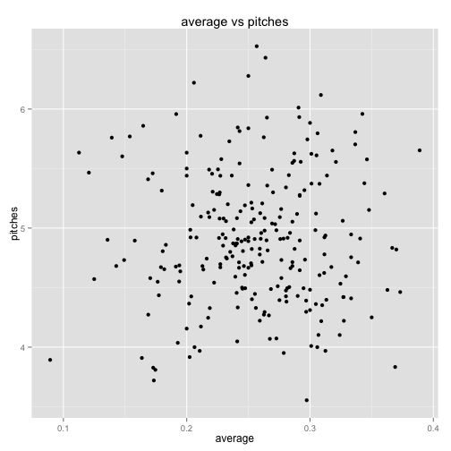
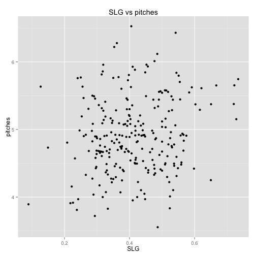
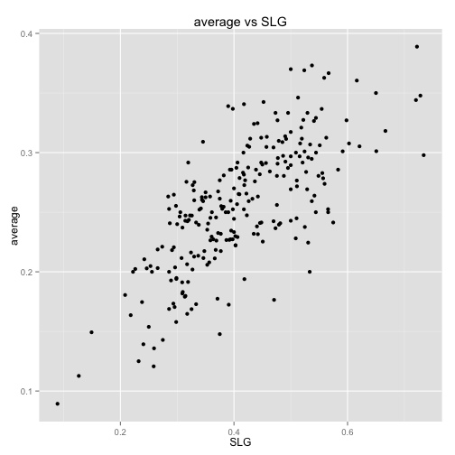

dplyrのsummarise_eachを使う
========================================================


## データ読み込み
2013年4月のMLB全打席結果データを利用して, 
dplyr::summarise_eachの練習をします.

データとコードは, 
https://github.com/gghatano/analyze_mlbdata_with_R/tree/master/batting_data/game_analysis/summarise
にあります. 

まずはデータの読み込み. 2013年4月の打席結果データ.csvをfread.

```r
library(data.table)
library(dplyr)
library(xtable)
dat = fread("../dat2013_04.csv")
```


## 集計
4月の打率, 長打率, 投球数を集計します. 

ヒット数,塁打数, 投球数の合計を, 打数で割り算すればいいのですが, 
全て同じ操作なので, 新機能であるsummarise_eachを使って簡単に処理できるはず.

```r
dat_april = 
  dat %>% 
  select(BAT_ID, AB_FL, H_FL, PITCH_SEQ_TX) %>% ## 打席フラグ, ヒットフラグ, 投球結果のデータを利用. 
  mutate(pitches = nchar(PITCH_SEQ_TX), HIT_FL = ifelse(H_FL > 0, 1, 0)) %>% ## 球数と, HITorNOTのデータを作成
  select(-PITCH_SEQ_TX) %>% ## もういらない
  group_by(BAT_ID) %>% ## 打者ごとに
  summarise_each(funs(sum)) %>% ## 塁打数, ヒット数, 投球数を打数で割り算する.
  dplyr::filter(AB_FL > 50) %>%
  mutate_each(funs(./AB_FL), vars = H_FL:HIT_FL) %>% 
  select(BAT_ID, vars1:vars3) %>% 
  setnames(c("retroID", "SLG", "pitches", "average"))

dat_april %>% head
```

```
##    retroID    SLG pitches average
## 1 ackld001 0.2857   4.824  0.2527
## 2 alony001 0.4479   4.896  0.2917
## 3 altuj001 0.4352   4.102  0.3241
## 4 alvap001 0.3146   5.315  0.1798
## 5 amara001 0.3585   4.491  0.2453
## 6 andre001 0.3300   4.910  0.2600
```

あとは, retroIDとフルネームを対応させて表示するだけ. 

## 4月の打率ランキング. 

```r
fullname= fread("../../fullname.csv")
dat_april %>% 
  inner_join(fullname, by = "retroID") %>%
  select(name, average) %>% 
  arrange(desc(average))%>% 
  head(10) %>%
  xtable %>% print(type="html")
```

<!-- html table generated in R 3.0.2 by xtable 1.7-3 package -->
<!-- Sat May 24 13:26:50 2014 -->
<TABLE border=1>
<TR> <TH>  </TH> <TH> name </TH> <TH> average </TH>  </TR>
  <TR> <TD align="right"> 1 </TD> <TD> Carlos Santana </TD> <TD align="right"> 0.39 </TD> </TR>
  <TR> <TD align="right"> 2 </TD> <TD> James Loney </TD> <TD align="right"> 0.37 </TD> </TR>
  <TR> <TD align="right"> 3 </TD> <TD> Torii Hunter </TD> <TD align="right"> 0.37 </TD> </TR>
  <TR> <TD align="right"> 4 </TD> <TD> Chris Johnson </TD> <TD align="right"> 0.37 </TD> </TR>
  <TR> <TD align="right"> 5 </TD> <TD> Jean Segura </TD> <TD align="right"> 0.37 </TD> </TR>
  <TR> <TD align="right"> 6 </TD> <TD> Miguel Cabrera </TD> <TD align="right"> 0.36 </TD> </TR>
  <TR> <TD align="right"> 7 </TD> <TD> Carlos Gomez </TD> <TD align="right"> 0.36 </TD> </TR>
  <TR> <TD align="right"> 8 </TD> <TD> Wilin Rosario </TD> <TD align="right"> 0.35 </TD> </TR>
  <TR> <TD align="right"> 9 </TD> <TD> Chris Davis </TD> <TD align="right"> 0.35 </TD> </TR>
  <TR> <TD align="right"> 10 </TD> <TD> Nate McLouth </TD> <TD align="right"> 0.35 </TD> </TR>
   </TABLE>


## 4月の長打率ランキング. 

```r
fullname= fread("../../fullname.csv")
dat_april %>% 
  inner_join(fullname, by = "retroID") %>%
  select(name, SLG) %>% 
  arrange(desc(SLG))%>% 
  head(10) %>%
  xtable %>% print(type="html")
```

<!-- html table generated in R 3.0.2 by xtable 1.7-3 package -->
<!-- Sat May 24 13:26:51 2014 -->
<TABLE border=1>
<TR> <TH>  </TH> <TH> name </TH> <TH> SLG </TH>  </TR>
  <TR> <TD align="right"> 1 </TD> <TD> Justin Upton </TD> <TD align="right"> 0.73 </TD> </TR>
  <TR> <TD align="right"> 2 </TD> <TD> Chris Davis </TD> <TD align="right"> 0.73 </TD> </TR>
  <TR> <TD align="right"> 3 </TD> <TD> Carlos Santana </TD> <TD align="right"> 0.72 </TD> </TR>
  <TR> <TD align="right"> 4 </TD> <TD> Bryce Harper </TD> <TD align="right"> 0.72 </TD> </TR>
  <TR> <TD align="right"> 5 </TD> <TD> Travis Hafner </TD> <TD align="right"> 0.67 </TD> </TR>
  <TR> <TD align="right"> 6 </TD> <TD> Mark Reynolds </TD> <TD align="right"> 0.65 </TD> </TR>
  <TR> <TD align="right"> 7 </TD> <TD> Wilin Rosario </TD> <TD align="right"> 0.65 </TD> </TR>
  <TR> <TD align="right"> 8 </TD> <TD> Dexter Fowler </TD> <TD align="right"> 0.62 </TD> </TR>
  <TR> <TD align="right"> 9 </TD> <TD> Carlos Gomez </TD> <TD align="right"> 0.62 </TD> </TR>
  <TR> <TD align="right"> 10 </TD> <TD> Troy Tulowitzki </TD> <TD align="right"> 0.60 </TD> </TR>
   </TABLE>


## 4月の平均投球数ランキング. 

```r
fullname= fread("../../fullname.csv")
dat_april %>% 
  inner_join(fullname, by = "retroID") %>%
  select(name, pitches) %>% 
  arrange(desc(pitches))%>% 
  head(10) %>%
  xtable %>% print(type="html")
```

<!-- html table generated in R 3.0.2 by xtable 1.7-3 package -->
<!-- Sat May 24 13:26:51 2014 -->
<TABLE border=1>
<TR> <TH>  </TH> <TH> name </TH> <TH> pitches </TH>  </TR>
  <TR> <TD align="right"> 1 </TD> <TD> Billy Butler </TD> <TD align="right"> 6.53 </TD> </TR>
  <TR> <TD align="right"> 2 </TD> <TD> Lucas Duda </TD> <TD align="right"> 6.43 </TD> </TR>
  <TR> <TD align="right"> 3 </TD> <TD> A.J. Ellis </TD> <TD align="right"> 6.28 </TD> </TR>
  <TR> <TD align="right"> 4 </TD> <TD> Will Venable </TD> <TD align="right"> 6.22 </TD> </TR>
  <TR> <TD align="right"> 5 </TD> <TD> Lance Berkman </TD> <TD align="right"> 6.12 </TD> </TR>
  <TR> <TD align="right"> 6 </TD> <TD> David Wright </TD> <TD align="right"> 6.01 </TD> </TR>
  <TR> <TD align="right"> 7 </TD> <TD> Mark Ellis </TD> <TD align="right"> 5.96 </TD> </TR>
  <TR> <TD align="right"> 8 </TD> <TD> Rickie Weeks </TD> <TD align="right"> 5.96 </TD> </TR>
  <TR> <TD align="right"> 9 </TD> <TD> Joey Votto </TD> <TD align="right"> 5.93 </TD> </TR>
  <TR> <TD align="right"> 10 </TD> <TD> Nick Swisher </TD> <TD align="right"> 5.93 </TD> </TR>
   </TABLE>


## グラフ

投げさせた球数と打率の関係.


```r
dat_april %>% 
  ggplot() + 
  geom_point(aes(x=average, y = pitches)) + 
  ggtitle("average vs pitches")
```

 

関係なさそう.

球数と長打率は? 


```r
dat_april %>% 
  ggplot() + 
  geom_point(aes(x=SLG, y = pitches)) + 
  ggtitle("SLG vs pitches")
```

 


```r
dat_april %>% 
  ggplot() + 
  geom_point(aes(x=SLG, y = average)) + 
  ggtitle("average vs SLG")
```

 

