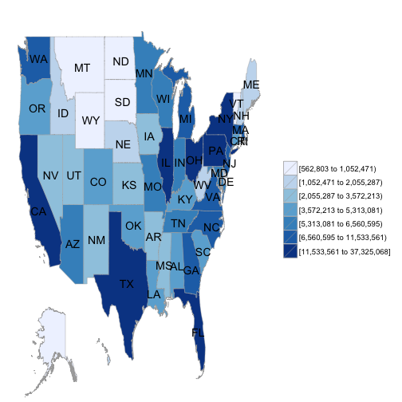
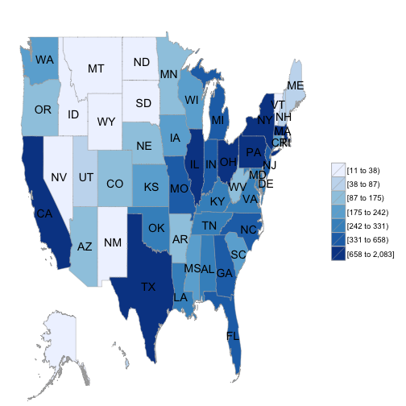
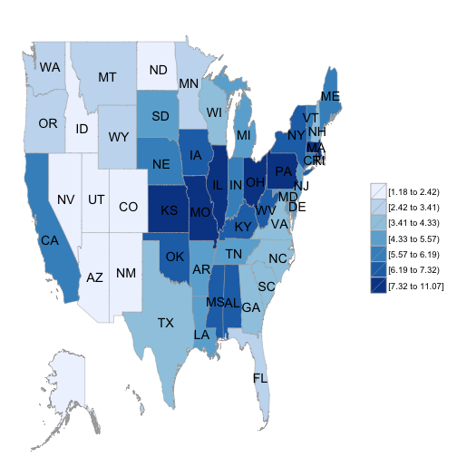

メジャーリーガーの出身地 Choroprethrの練習)
===

Choroplethrが面白いので, 色々と使ってみたいです. 

今回は, メジャーリーガーの出身地分布を可視化します.  

## 準備

```r
library(data.table)
library(dplyr)
library(choroplethr)
library(choroplethrMaps)
library(choroplethrAdmin1)
```

## 使い方の確認

Choroplethrの使い方を確認しておきます. 
マニュアル通りに, アメリカ各州の人口データを可視化してみます. 


```r
data(df_pop_state)
df_pop_state %>% head
```

```
##       region    value
## 1    alabama  4777326
## 2     alaska   711139
## 3    arizona  6410979
## 4   arkansas  2916372
## 5 california 37325068
## 6   colorado  5042853
```

```r
df_pop_state %>% state_choropleth()
```

 

regionに州の名前, valueに値を入れたデータフレームを用意すればいいみたいです. 

## メジャーリーガーの出身地データ

メジャーリーグのデータを用意します. 

これは簡単で, Lahmanパッケージをインストールするだけです. 

Masterという名前のデータが入っています. 


```r
## install.packages("Lahman")
library(Lahman)
data(Master)

## データのサイズ確認
Master %>% dim
```

```
## [1] 18354    26
```

```r
dat_master = 
  Master %>% as.data.table %>% 
  select(nameFirst, nameLast, birthYear, birthCountry, birthState) 
dat_master %>% head
```

```
##    nameFirst nameLast birthYear birthCountry birthState
## 1:     David  Aardsma      1981          USA         CO
## 2:      Hank    Aaron      1934          USA         AL
## 3:    Tommie    Aaron      1939          USA         AL
## 4:       Don     Aase      1954          USA         CA
## 5:      Andy     Abad      1972          USA         FL
## 6:  Fernando     Abad      1985         D.R.  La Romana
```

18354人分の歴代メジャーリーガーについて, 名前, 誕生日, 出生地などのデータが格納されています. 

他にも色々と面白そうなデータが入っていますが, 今回使うのは出生州です.  

各州ごとにメジャーリーガーの数を集計してみます. 


```r
dat_player_state = 
  dat_master %>% 
  group_by(birthState) %>%
  summarise(n = n()) %>% 
  arrange(desc(n))
dat_player_state %>% head
```

```
##   birthState    n
## 1         CA 2083
## 2         PA 1406
## 3         NY 1200
## 4         IL 1046
## 5         OH 1024
## 6         TX  860
```

CAってどの州の略称ですかね. よく分かりません. 

最終的には, 州の完全な名前に変更しないといけません. 

datasets::stateのデータを使えば, 略称とフルネームとの対応付けが出来ます. 


```r
library(datasets)
data(state)
## 州の名前と略称の対応表
dat_state = data.frame(name = state.name, name.abb = state.abb)
dat_state %>% head
```

```
##         name name.abb
## 1    Alabama       AL
## 2     Alaska       AK
## 3    Arizona       AZ
## 4   Arkansas       AR
## 5 California       CA
## 6   Colorado       CO
```

```r
## 出生地集計データとマージして, 
dat_player_state_for_coropleth = 
  dat_state %>% 
  mutate(birthState = name.abb) %>% 
  merge(dat_player_state, by = "birthState") %>% 
  mutate(region = tolower(name)) %>% 
  mutate(value = n) 

## 上位5州
dat_player_state_for_coropleth %>% 
  select(region, value) %>% arrange(desc(value)) %>% 
  head(5)
```

```
##         region value
## 1   california  2083
## 2 pennsylvania  1406
## 3     new york  1200
## 4     illinois  1046
## 5         ohio  1024
```

```r
dat_player_state_for_coropleth %>% 
  state_choropleth()
```

 

出身地別メジャーリーガーの人数の可視化が出来ました. 

## 10万人あたりメジャーリーガーの数

人口に対するメジャーリーガーの数で比べてみたいです. 

メジャーリーガーの数を今の人口で割って, 10万人あたりのメジャーリーガー数を見てみます. 


```r
dat_player_ratio = 
  dat_player_state_for_coropleth %>%
  select(-value) %>% 
  merge(df_pop_state, by = "region")  %>% 
  mutate(value = n / value * 100000) %>% 
  select(region, value)

## 上位5州
dat_player_ratio %>% 
  arrange(desc(value)) %>%
  head(5)
```

```
##          region     value
## 1  pennsylvania 11.071224
## 2 massachusetts 10.029578
## 3      missouri  9.979251
## 4          ohio  8.878437
## 5      illinois  8.156670
```

```r
## 下位5州
dat_player_ratio %>% 
  arrange(desc(value)) %>%
  tail(5)
```

```
##        region    value
## 46     alaska 1.546814
## 47    arizona 1.450636
## 48       utah 1.373709
## 49 new mexico 1.265030
## 50     nevada 1.183343
```

```r
dat_player_ratio %>% state_choropleth()
```

 

ベスト3はペニンシュラ州, マサチューセッツ州, ミズーリ州.

ワースト3は, ネバダ州, ニューメキシコ州, ユタ州でした. 

...よく分かりません. 

## 感想

州の完全な名前とデータを対応付けるのが, 少し怖いです. 


