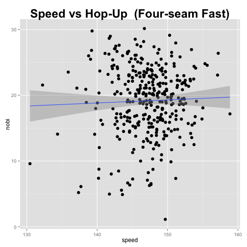

ボールの "ノビ" と空振り率
========================================================


## 導入
いわゆる"ノビのあるストレート"の性能を評価したいと思います. 

pitch f/x のデータから, ボールの垂直上方向変化に注目.
空振り率の高さを計算して, ノビについて考えます. 

2013年のMLB全試合の全投球のデータを利用して, 集計していきます. 


## データ読み込み

```r
library(data.table)
library(dplyr)
library(xtable)
library(magrittr)
library(ggplot2)
data_file = "../../../../Box Sync/pitch_fx/2013.csv"
dat = fread(data_file)
```


Read 0.0% of 764814 rows
Read 9.2% of 764814 rows
Read 22.2% of 764814 rows
Read 28.8% of 764814 rows
Read 35.3% of 764814 rows
Read 41.8% of 764814 rows
Read 49.7% of 764814 rows
Read 56.2% of 764814 rows
Read 64.1% of 764814 rows
Read 71.9% of 764814 rows
Read 79.8% of 764814 rows
Read 88.9% of 764814 rows
Read 99.4% of 764814 rows
Read 764814 rows and 53 (of 53) columns from 0.381 GB file in 00:00:21

```r
dat = dat %>% dplyr::filter(ax != "NA")
dat_FF = dat %>% dplyr::filter(pitch_type=="FF")
```


## 手法

"空振り率"で, 伸びのあるストレートの性能を評価したいと思います.

空振り率は, 
$$\frac{\text{Swing}}{\text{FF-Pitch} -\text{Called Strike}} $$
とします. 

ここで, 

swing :: 空振り

FF-pitch :: ストレートの投球数

Called Strike :: 見逃しストライク

です. 

空振り率と, 垂直上方向の変化量との関係を確認します. 

pitch f/x のデータにある pfx_z は, 質点を仮定した場合のボールと比べて, どの程度ホップアップしたか...ということを表すという数値です. 

普通の質点と, バックスピンのかかったボール.
後者のほうが, 落ちにくくなります.つまりノビです.
pfx_zという数値は, ボールのノビを表していると考えていいと思います. 


早速, 集計していきます. 

## 集計

```r
dat_FF_swingrate = 
  dat_FF %>% 
  select(pitcher_name, start_speed, des, pfx_z) %>% 
  mutate(pfx_z = as.numeric(pfx_z)) %>%
  mutate(calledStrike = (des=="Called Strike")) %>% 
  mutate(swingingStrike = (des == "Swinging Strike")) %>% 
  group_by(pitcher_name) %>% 
  dplyr::summarise(nobi = mean(pfx_z)*2.5, 
                   speed = mean(as.numeric(start_speed) * 1.6),
                   calledStrike = sum(calledStrike), 
                   swingingStrike = sum(swingingStrike, na.rm=TRUE), 
                   pitches = n()) %>% 
  dplyr::filter(pitches > 200) %>% 
  mutate(swingRate = swingingStrike / (pitches - calledStrike))
```


## 空振り率ランキング.

```r
dat_FF_swingrate %>%
  arrange(desc(swingRate)) %>% 
  select(pitcher_name, swingRate) %>%
  head(20) %>%
  xtable(digits = 4) %>% print("html") 
```

<!-- html table generated in R 3.0.2 by xtable 1.7-3 package -->
<!-- Sat May 31 12:50:54 2014 -->
<TABLE border=1>
<TR> <TH>  </TH> <TH> pitcher_name </TH> <TH> swingRate </TH>  </TR>
  <TR> <TD align="right"> 1 </TD> <TD> Darren O'Day </TD> <TD align="right"> 0.2000 </TD> </TR>
  <TR> <TD align="right"> 2 </TD> <TD> Caleb Thielbar </TD> <TD align="right"> 0.1940 </TD> </TR>
  <TR> <TD align="right"> 3 </TD> <TD> Ernesto Frieri </TD> <TD align="right"> 0.1928 </TD> </TR>
  <TR> <TD align="right"> 4 </TD> <TD> Aroldis Chapman </TD> <TD align="right"> 0.1892 </TD> </TR>
  <TR> <TD align="right"> 5 </TD> <TD> Casey Fien </TD> <TD align="right"> 0.1818 </TD> </TR>
  <TR> <TD align="right"> 6 </TD> <TD> Danny Salazar </TD> <TD align="right"> 0.1602 </TD> </TR>
  <TR> <TD align="right"> 7 </TD> <TD> Tyler Clippard </TD> <TD align="right"> 0.1599 </TD> </TR>
  <TR> <TD align="right"> 8 </TD> <TD> Jim Henderson </TD> <TD align="right"> 0.1587 </TD> </TR>
  <TR> <TD align="right"> 9 </TD> <TD> Trevor Rosenthal </TD> <TD align="right"> 0.1572 </TD> </TR>
  <TR> <TD align="right"> 10 </TD> <TD> Robert Coello </TD> <TD align="right"> 0.1561 </TD> </TR>
  <TR> <TD align="right"> 11 </TD> <TD> Jared Burton </TD> <TD align="right"> 0.1488 </TD> </TR>
  <TR> <TD align="right"> 12 </TD> <TD> Jason Grilli </TD> <TD align="right"> 0.1459 </TD> </TR>
  <TR> <TD align="right"> 13 </TD> <TD> Koji Uehara </TD> <TD align="right"> 0.1441 </TD> </TR>
  <TR> <TD align="right"> 14 </TD> <TD> Craig Kimbrel </TD> <TD align="right"> 0.1417 </TD> </TR>
  <TR> <TD align="right"> 15 </TD> <TD> Sean Doolittle </TD> <TD align="right"> 0.1414 </TD> </TR>
  <TR> <TD align="right"> 16 </TD> <TD> Michael Kohn </TD> <TD align="right"> 0.1413 </TD> </TR>
  <TR> <TD align="right"> 17 </TD> <TD> Glen Perkins </TD> <TD align="right"> 0.1394 </TD> </TR>
  <TR> <TD align="right"> 18 </TD> <TD> Carter Capps </TD> <TD align="right"> 0.1390 </TD> </TR>
  <TR> <TD align="right"> 19 </TD> <TD> Kelvin Herrera </TD> <TD align="right"> 0.1374 </TD> </TR>
  <TR> <TD align="right"> 20 </TD> <TD> Joshua Fields </TD> <TD align="right"> 0.1365 </TD> </TR>
   </TABLE>


4位のチャップマン. 170kmのストレートを投げます. 

上原が13位ですか.

## ノビのあるストレートランキング

```r
dat_FF_swingrate %>%
  arrange(desc(nobi)) %>% 
  select(pitcher_name, nobi) %>%
  head(20) %>%
  xtable(digits = 4) %>% print("html") 
```

<!-- html table generated in R 3.0.2 by xtable 1.7-3 package -->
<!-- Sat May 31 12:50:54 2014 -->
<TABLE border=1>
<TR> <TH>  </TH> <TH> pitcher_name </TH> <TH> nobi </TH>  </TR>
  <TR> <TD align="right"> 1 </TD> <TD> Antonio Bastardo </TD> <TD align="right"> 30.1465 </TD> </TR>
  <TR> <TD align="right"> 2 </TD> <TD> Josh Collmenter </TD> <TD align="right"> 29.7795 </TD> </TR>
  <TR> <TD align="right"> 3 </TD> <TD> Andrew Bailey </TD> <TD align="right"> 29.1244 </TD> </TR>
  <TR> <TD align="right"> 4 </TD> <TD> Matt Reynolds </TD> <TD align="right"> 28.9786 </TD> </TR>
  <TR> <TD align="right"> 5 </TD> <TD> Evan Scribner </TD> <TD align="right"> 28.6614 </TD> </TR>
  <TR> <TD align="right"> 6 </TD> <TD> Jake Odorizzi </TD> <TD align="right"> 28.5236 </TD> </TR>
  <TR> <TD align="right"> 7 </TD> <TD> Chris Tillman </TD> <TD align="right"> 28.1677 </TD> </TR>
  <TR> <TD align="right"> 8 </TD> <TD> Jesse Crain </TD> <TD align="right"> 27.9543 </TD> </TR>
  <TR> <TD align="right"> 9 </TD> <TD> Matt Magill </TD> <TD align="right"> 27.6820 </TD> </TR>
  <TR> <TD align="right"> 10 </TD> <TD> Tommy Hanson </TD> <TD align="right"> 27.6119 </TD> </TR>
  <TR> <TD align="right"> 11 </TD> <TD> Koji Uehara </TD> <TD align="right"> 27.4776 </TD> </TR>
  <TR> <TD align="right"> 12 </TD> <TD> Brian Matusz </TD> <TD align="right"> 27.4275 </TD> </TR>
  <TR> <TD align="right"> 13 </TD> <TD> Clayton Kershaw </TD> <TD align="right"> 27.3777 </TD> </TR>
  <TR> <TD align="right"> 14 </TD> <TD> Marco Estrada </TD> <TD align="right"> 27.0921 </TD> </TR>
  <TR> <TD align="right"> 15 </TD> <TD> Kevin Slowey </TD> <TD align="right"> 27.0741 </TD> </TR>
  <TR> <TD align="right"> 16 </TD> <TD> Tim Collins </TD> <TD align="right"> 26.9664 </TD> </TR>
  <TR> <TD align="right"> 17 </TD> <TD> Greg Holland </TD> <TD align="right"> 26.9479 </TD> </TR>
  <TR> <TD align="right"> 18 </TD> <TD> Tommy Milone </TD> <TD align="right"> 26.8249 </TD> </TR>
  <TR> <TD align="right"> 19 </TD> <TD> Tony Sipp </TD> <TD align="right"> 26.6869 </TD> </TR>
  <TR> <TD align="right"> 20 </TD> <TD> Wandy Rodriguez </TD> <TD align="right"> 26.6627 </TD> </TR>
   </TABLE>

```r

## 平均. 
dat_FF_swingrate %>% 
  dplyr::summarise(nobi = mean(nobi)) %>% 
  xtable(digit = 4) %>% print("html")
```

<!-- html table generated in R 3.0.2 by xtable 1.7-3 package -->
<!-- Sat May 31 12:50:54 2014 -->
<TABLE border=1>
<TR> <TH>  </TH> <TH> nobi </TH>  </TR>
  <TR> <TD align="right"> 1 </TD> <TD align="right"> 19.1602 </TD> </TR>
   </TABLE>

```r
  
```


上原が11位. 

## プロット

縦方向の変化と空振り率との関係を, プロットしてみます.


```r
dat_FF_swingrate %>% 
  ggplot(aes(x = nobi, y = swingRate)) + 
  geom_point(size = 3) + stat_smooth(method="lm") + 
  ggtitle("Hop-Up vs Swing-Rate  (Four-seam Fast)") + 
  theme(plot.title = element_text(face="bold", size=24))
```

 


やっぱりスピードのほうが大事なんですかね? 
初速と空振り率の関係を, プロットしてみます.

```r
dat_FF_swingrate %>% 
  ggplot(aes(x = speed, y = swingRate)) + 
  geom_point(size = 3) + stat_smooth(method="lm") + 
  ggtitle("Speed vs Swing-Rate  (Four-seam Fast)") + 
  theme(plot.title = element_text(face="bold", size=24))
```

 


おまけ. ストレートとノビ.

```r
dat_FF_swingrate %>% 
  ggplot(aes(x = speed, y = nobi)) + 
  geom_point(size = 3) + stat_smooth(method="lm") + 
  ggtitle("Speed vs Hop-Up  (Four-seam Fast)") + 
  theme(plot.title = element_text(face="bold", size=24))
```

 


あまり関係なさそう. 

## 考察

単なる1つのボールの物理的な性質だけから議論するのは難しそう. 

変化球の組み合わせ? フォーム? 
