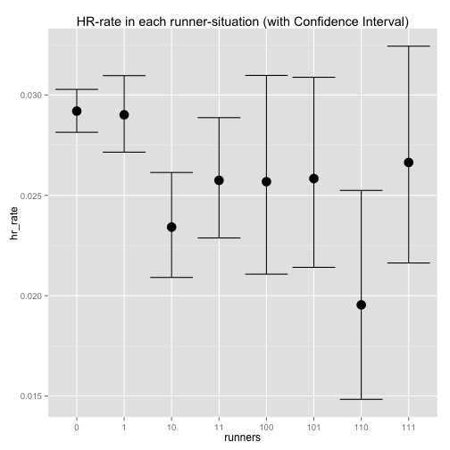

ランナーの状況とホームラン
========================================================


ランナー状況とホームランの関係が気になりました. 

調べてみました.

コードはgithubにあげてあります. 

https://github.com/gghatano/analyze_mlbdata_with_R

ランナー状況ごとに, ホームラン率を計算してみます.
まずはデータの読み込み. 適当な所に, retrosheetからダウンロードしたデータを置いて読み込みます. 


```r
library(dplyr)
library(data.table)
library(magrittr)
library(xtable)
dat = fread("../../../data/all2013.csv")
```


Read 57.6% of 190907 rows
Read 190907 rows and 97 (of 97) columns from 0.076 GB file in 00:00:03

```r
name = fread("../../batting_data/names.csv", header = FALSE) %>% unlist
dat %>% setnames(name)
```


ランナーの人数ごとに, ホームランの本数を集計してみます.

```r
dat_hr_runner = 
  dat %>% 
  dplyr::filter(AB_FL == "T") %>%
  mutate(runners = (BASE1_RUN_ID != "") + (BASE2_RUN_ID != "") + (BASE3_RUN_ID != "")) %>% 
  mutate(HR_FL = (EVENT_CD == 23)) %>%
  group_by(runners) %>% 
  dplyr::summarise(atbats = n(), hrs = sum(HR_FL)) %>% 
  mutate(runners = as.integer(runners)) 

dat_hr_runner %>%
  xtable(digits = 4) %>% print("html")
```

<!-- html table generated in R 3.0.2 by xtable 1.7-3 package -->
<!-- Sat May 31 09:27:15 2014 -->
<TABLE border=1>
<TR> <TH>  </TH> <TH> runners </TH> <TH> atbats </TH> <TH> hrs </TH>  </TR>
  <TR> <TD align="right"> 1 </TD> <TD align="right">     0 </TD> <TD align="right"> 96284 </TD> <TD align="right">  2811 </TD> </TR>
  <TR> <TD align="right"> 2 </TD> <TD align="right">     1 </TD> <TD align="right"> 47666 </TD> <TD align="right">  1295 </TD> </TR>
  <TR> <TD align="right"> 3 </TD> <TD align="right">     2 </TD> <TD align="right"> 18516 </TD> <TD align="right">   459 </TD> </TR>
  <TR> <TD align="right"> 4 </TD> <TD align="right">     3 </TD> <TD align="right">  3604 </TD> <TD align="right">    96 </TD> </TR>
   </TABLE>


ホームラン率を見ます. 

```r
dat_hr_runner %>% 
  dplyr::mutate(hr_rate = hrs / atbats) %>%
  xtable(digits = 4) %>% print("html")
```

<!-- html table generated in R 3.0.2 by xtable 1.7-3 package -->
<!-- Sat May 31 09:27:15 2014 -->
<TABLE border=1>
<TR> <TH>  </TH> <TH> runners </TH> <TH> atbats </TH> <TH> hrs </TH> <TH> hr_rate </TH>  </TR>
  <TR> <TD align="right"> 1 </TD> <TD align="right">     0 </TD> <TD align="right"> 96284 </TD> <TD align="right">  2811 </TD> <TD align="right"> 0.0292 </TD> </TR>
  <TR> <TD align="right"> 2 </TD> <TD align="right">     1 </TD> <TD align="right"> 47666 </TD> <TD align="right">  1295 </TD> <TD align="right"> 0.0272 </TD> </TR>
  <TR> <TD align="right"> 3 </TD> <TD align="right">     2 </TD> <TD align="right"> 18516 </TD> <TD align="right">   459 </TD> <TD align="right"> 0.0248 </TD> </TR>
  <TR> <TD align="right"> 4 </TD> <TD align="right">     3 </TD> <TD align="right">  3604 </TD> <TD align="right">    96 </TD> <TD align="right"> 0.0266 </TD> </TR>
   </TABLE>

ランナー0人のホームラン率が, ちょっと高いですね.
なんででしょうか. 


もう少し細かく見てみます. 
ランナー状況, つまりどの塁が埋まっているか...という状況ごとに, ホームランの本数を見てみます. 


```r
dat_runner_123 = 
  dat %>% 
  dplyr::filter(AB_FL == "T") %>% 
  mutate(runners = (BASE1_RUN_ID != "")*1 + (BASE2_RUN_ID != "") * 10 + (BASE3_RUN_ID != "")*100) %>%
  mutate(runners = as.integer(runners)) %>%
  mutate(HR_FL = (EVENT_CD == 23)) %>% 
  group_by(runners) %>% 
  dplyr::summarise(atbat = n(), hrs = sum(HR_FL))

dat_runner_123 %>%
  xtable(digits = 4) %>% print("html")
```

<!-- html table generated in R 3.0.2 by xtable 1.7-3 package -->
<!-- Sat May 31 09:27:17 2014 -->
<TABLE border=1>
<TR> <TH>  </TH> <TH> runners </TH> <TH> atbat </TH> <TH> hrs </TH>  </TR>
  <TR> <TD align="right"> 1 </TD> <TD align="right">     0 </TD> <TD align="right"> 96284 </TD> <TD align="right">  2811 </TD> </TR>
  <TR> <TD align="right"> 2 </TD> <TD align="right">     1 </TD> <TD align="right"> 30299 </TD> <TD align="right">   879 </TD> </TR>
  <TR> <TD align="right"> 3 </TD> <TD align="right">    10 </TD> <TD align="right"> 13239 </TD> <TD align="right">   310 </TD> </TR>
  <TR> <TD align="right"> 4 </TD> <TD align="right">    11 </TD> <TD align="right"> 11070 </TD> <TD align="right">   285 </TD> </TR>
  <TR> <TD align="right"> 5 </TD> <TD align="right">   100 </TD> <TD align="right">  4128 </TD> <TD align="right">   106 </TD> </TR>
  <TR> <TD align="right"> 6 </TD> <TD align="right">   101 </TD> <TD align="right">  4529 </TD> <TD align="right">   117 </TD> </TR>
  <TR> <TD align="right"> 7 </TD> <TD align="right">   110 </TD> <TD align="right">  2917 </TD> <TD align="right">    57 </TD> </TR>
  <TR> <TD align="right"> 8 </TD> <TD align="right">   111 </TD> <TD align="right">  3604 </TD> <TD align="right">    96 </TD> </TR>
   </TABLE>


できてますね. ホームラン率を計算してみます. 


```r
dat_runner_123 %>% 
  mutate(hr_rate = hrs / atbat) %>%
  xtable(digits = 4) %>% print("html")
```

<!-- html table generated in R 3.0.2 by xtable 1.7-3 package -->
<!-- Sat May 31 09:27:17 2014 -->
<TABLE border=1>
<TR> <TH>  </TH> <TH> runners </TH> <TH> atbat </TH> <TH> hrs </TH> <TH> hr_rate </TH>  </TR>
  <TR> <TD align="right"> 1 </TD> <TD align="right">     0 </TD> <TD align="right"> 96284 </TD> <TD align="right">  2811 </TD> <TD align="right"> 0.0292 </TD> </TR>
  <TR> <TD align="right"> 2 </TD> <TD align="right">     1 </TD> <TD align="right"> 30299 </TD> <TD align="right">   879 </TD> <TD align="right"> 0.0290 </TD> </TR>
  <TR> <TD align="right"> 3 </TD> <TD align="right">    10 </TD> <TD align="right"> 13239 </TD> <TD align="right">   310 </TD> <TD align="right"> 0.0234 </TD> </TR>
  <TR> <TD align="right"> 4 </TD> <TD align="right">    11 </TD> <TD align="right"> 11070 </TD> <TD align="right">   285 </TD> <TD align="right"> 0.0257 </TD> </TR>
  <TR> <TD align="right"> 5 </TD> <TD align="right">   100 </TD> <TD align="right">  4128 </TD> <TD align="right">   106 </TD> <TD align="right"> 0.0257 </TD> </TR>
  <TR> <TD align="right"> 6 </TD> <TD align="right">   101 </TD> <TD align="right">  4529 </TD> <TD align="right">   117 </TD> <TD align="right"> 0.0258 </TD> </TR>
  <TR> <TD align="right"> 7 </TD> <TD align="right">   110 </TD> <TD align="right">  2917 </TD> <TD align="right">    57 </TD> <TD align="right"> 0.0195 </TD> </TR>
  <TR> <TD align="right"> 8 </TD> <TD align="right">   111 </TD> <TD align="right">  3604 </TD> <TD align="right">    96 </TD> <TD align="right"> 0.0266 </TD> </TR>
   </TABLE>


ほほう. 
ランナー2,3塁打とホームランが出にくい. 

95％信頼区間も出しますか.

```r
dat_hr_123_conf = 
  dat_runner_123 %>% 
  group_by(runners) %>% 
  summarise(hr_rate = hrs / atbat, 
         (binom.test(hrs, atbat))$conf.int[1], 
         (binom.test(hrs, atbat))$conf.int[2]) %>% 
  setnames(c("runners", "hr_rate", "hr_rate_low", "hr_rate_high"))
dat_hr_123_conf %>%
  xtable(digits = 4) %>% print("html")
```

<!-- html table generated in R 3.0.2 by xtable 1.7-3 package -->
<!-- Sat May 31 09:27:17 2014 -->
<TABLE border=1>
<TR> <TH>  </TH> <TH> runners </TH> <TH> hr_rate </TH> <TH> hr_rate_low </TH> <TH> hr_rate_high </TH>  </TR>
  <TR> <TD align="right"> 1 </TD> <TD align="right">     0 </TD> <TD align="right"> 0.0292 </TD> <TD align="right"> 0.0281 </TD> <TD align="right"> 0.0303 </TD> </TR>
  <TR> <TD align="right"> 2 </TD> <TD align="right">     1 </TD> <TD align="right"> 0.0290 </TD> <TD align="right"> 0.0271 </TD> <TD align="right"> 0.0310 </TD> </TR>
  <TR> <TD align="right"> 3 </TD> <TD align="right">    10 </TD> <TD align="right"> 0.0234 </TD> <TD align="right"> 0.0209 </TD> <TD align="right"> 0.0261 </TD> </TR>
  <TR> <TD align="right"> 4 </TD> <TD align="right">    11 </TD> <TD align="right"> 0.0257 </TD> <TD align="right"> 0.0229 </TD> <TD align="right"> 0.0289 </TD> </TR>
  <TR> <TD align="right"> 5 </TD> <TD align="right">   100 </TD> <TD align="right"> 0.0257 </TD> <TD align="right"> 0.0211 </TD> <TD align="right"> 0.0310 </TD> </TR>
  <TR> <TD align="right"> 6 </TD> <TD align="right">   101 </TD> <TD align="right"> 0.0258 </TD> <TD align="right"> 0.0214 </TD> <TD align="right"> 0.0309 </TD> </TR>
  <TR> <TD align="right"> 7 </TD> <TD align="right">   110 </TD> <TD align="right"> 0.0195 </TD> <TD align="right"> 0.0148 </TD> <TD align="right"> 0.0252 </TD> </TR>
  <TR> <TD align="right"> 8 </TD> <TD align="right">   111 </TD> <TD align="right"> 0.0266 </TD> <TD align="right"> 0.0216 </TD> <TD align="right"> 0.0324 </TD> </TR>
   </TABLE>


折角なので, 可視化しましょう. 

```r
dat_hr_123_conf %>% 
  mutate(runners = as.factor(runners)) %>%
  ggplot(aes(x = runners)) +
  geom_point(aes(y = hr_rate), size = 5) + 
  geom_errorbar(aes(ymin = hr_rate_low, ymax = hr_rate_high)) + 
  ggtitle("HR-rate in each runner-situation (with Confidence Interval)")
```

 


以上です. 


