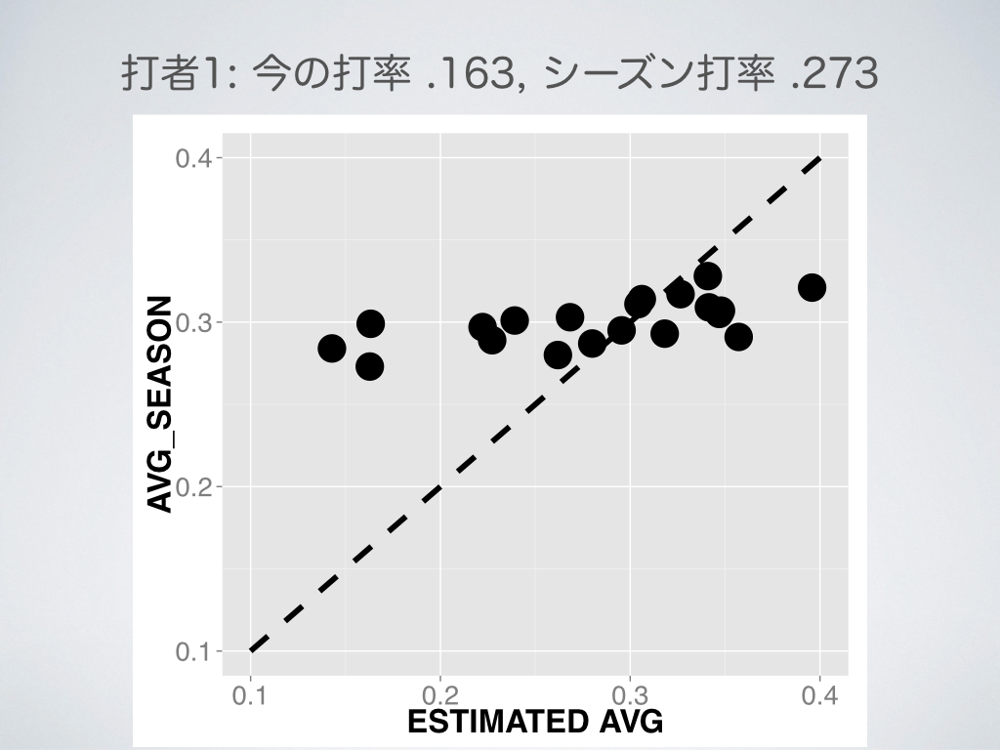
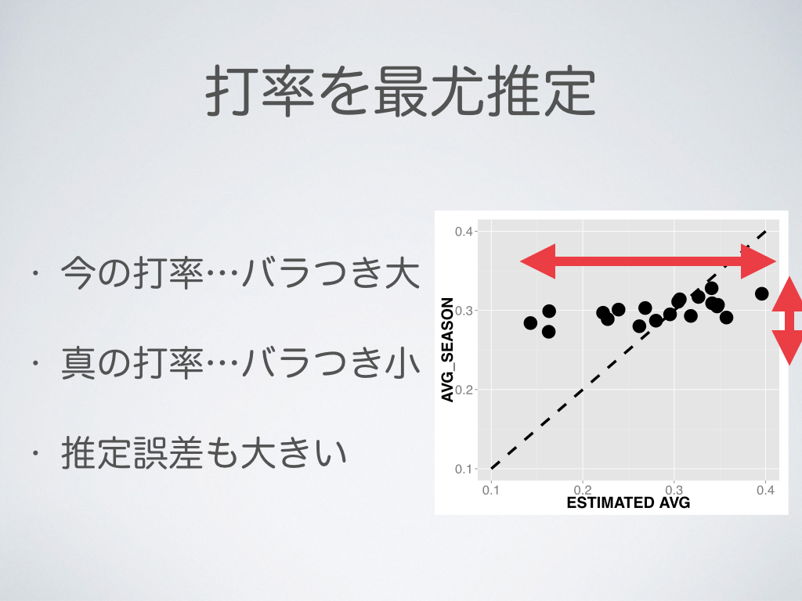

```{r global_option, echo=FALSE, error=FALSE, warning=FALSE}
opts_chunk$set(tidy=FALSE, message=FALSE, warning=FALSE)
```

<div style='text-align: center;'>
    
</div>

---
<div style='text-align: center;'>
    
</div>

---
<div style='text-align: center;'>
    
</div>

---
<div style='text-align: center;'>
    
</div>

---
## Outline 

### 1. Problem: Predict the full-season Batting Average 

<br>

### 2. Predict Batting Average with Maximum Likelihood Estimation

<br>

### 3. Predict Batting Average with Hierarchical Bayes Model


---

## Problem

### Predict the __full-season__ AVG from data of __first 20 days of 2013 season (~ 4/20)__ 
```{r echo = FALSE, results='asis'}
library(data.table)
library(ggplot2)
library(dplyr)
library(magrittr)
library(xtable)
dat_m_april = fread("dat_before_A20.csv")
dat_m_april %>% head(10) %>% 
  mutate(AVG_SEASON = round(AVG_SEASON, 3)) %>% 
  mutate(AVG = round(AVG, 3)) %>% 
  select(FULLNAME, ATBAT, HITS, AVG, AVG_SEASON) %>%
  xtable() %>% print(type="html")
```

Data : Major League Baseball games (2013) ... Open Data

http://www.retrosheet.org/boxesetc/2013/Y_2013.htm


--- 

## Words

### ATBAT : number of trial 

### HIT :  number of success

### AVG : success rate

### batter: 89 batters (over 500 atbats)

<br>

```{r results='asis', echo=FALSE}
dat_m_april %>% head(5) %>% 
  mutate(AVG_SEASON = round(AVG_SEASON, 3)) %>% 
  mutate(AVG = round(AVG, 3)) %>% 
  select(FULLNAME, ATBAT, HITS, AVG, AVG_SEASON) %>%
  xtable() %>% print(type="html")
```

--- 
## Outline 

### 1. Problem: Predict the full-season Batting Average 

<br>

### 2. Predict Batting Average with Maximum Likelihood Estimation

<br>

### 3. Predict Batting Average with Hierarchical Bayes Model

---


## Randomness

<br>

Ex. Batting Result of Ichiro (April,2013)

HIT, OUT, OUT, HIT, OUT, HIT, OUT, OUT , OUT, ... 


<br>

$n$ hits / $N$ atbats $\to$ Likelihood $\mathrm{L}(q)$: 

$$\begin{align*}
 \mathrm{L}(q) &= \binom{N}{n}q^n (1-q)^{N-n}.
\end{align*}$$

where $q$ is the true Batting Average.

 
 $\to$ Predict Batting Average

---&twocol

## Maximum Likelihood Estimation

*** =left

Likelihood $\mathrm{L}(q)$:
$$\begin{align*}
 \mathrm{L}(q) = \binom{N}{n}q^n (1-q)^{N-n}.
\end{align*}$$

<br>

Estimated parameter value $\hat{q}$:

$$\begin{align*}
 \hat{q} = \mathrm{argmax} ~ \mathrm{L}(q)
\end{align*}$$

*** =right

```{r echo = FALSE, out.width='\\textwidth',  fig.align='center'}
q = seq(0, 1, by = 0.01)
L = dbinom(37, 100, q)
dat = data.frame(q=q, L=L)
ggplot(dat, aes(x=q, y=L)) + geom_line(size=2) + ggtitle("Likelihood: L(q)") + 
  geom_vline(x=0.37, linetype="dashed", size = 2, color="red") +  
  theme(plot.title=element_text(size=24, face="bold"))
```

---&twocol

## Maximum Likelihood Estimation

*** =left

Likelihood $\mathrm{L}(q)$:
$$\begin{align*}
 \mathrm{L}(q) = \binom{N}{n}q^n (1-q)^{N-n}.
\end{align*}$$

<br>

Solve
$$\begin{align*}
\frac{\partial}{\partial q_i} \log \mathrm{L}(q_i) &= 0, \\
  \frac{n_i}{q_i} - \frac{N_i-n_i}{1-q_i} &= 0, \\ 
  \hat{q_i} &= \frac{n_i}{N_i}. 
\end{align*}$$
*** =right

```{r echo=FALSE, results='asis', out.width='\\textwidth',  fig.align='center'}

dat_for_plot = dat_m_april %>% mutate(AVG_SEASON = round(AVG_SEASON,3))
dat_for_plot %>% mutate(MLE = AVG) %>%
  select(FULLNAME, AVG, MLE, AVG_SEASON) %>%
  head(10) %>%
  xtable() %>% print(type="html")
```

---&twocol

## Maximum Likelihood Estimation

*** =left

```{r echo=FALSE, results='asis', out.width='\\textwidth',  fig.align='center', warning=FALSE}
# library(rCharts)
dat_for_plot = dat_m_april %>% mutate(AVG_SEASON = round(AVG_SEASON,3))
dat_for_plot %>% 
  ggplot(aes(y=AVG_SEASON, x=AVG)) + geom_point(size = 4) + 
  stat_function(fun = function(x) x, colour = "black", linetype="dashed") + 
  xlab("ESTIMATED AVG") +
  theme(axis.text.x=element_text(size=20)) +
  theme(axis.text.y=element_text(size=20)) +
  theme(axis.title.x=element_text(size=24, face="bold")) +
  theme(axis.title.y=element_text(size=24, face="bold"))
```


*** =right

```{r echo=FALSE, results='asis', out.width='\\textwidth',  fig.align='center'}

dat_for_plot = dat_m_april %>% mutate(AVG_SEASON = round(AVG_SEASON,3))
dat_for_plot %>% mutate(MLE = AVG) %>%
  select(FULLNAME, AVG, MLE, AVG_SEASON) %>%
  head(10) %>%
  xtable() %>% print(type="html")
```

### ... How can we Shrink the value to mean?

---

<div style='text-align: center;'>
    
</div>


---
<div style='text-align: center;'>
    
</div>


---

<div style='text-align: center;'>
    
</div>


---
<div style='text-align: center;'>
    
</div>


---
<div style='text-align: center;'>
    
</div>


---
<div style='text-align: center;'>
    
</div>


---

<div style='text-align: center;'>
    
</div>


---
<div style='text-align: center;'>
    
</div>


---
<div style='text-align: center;'>
    
</div>


---

## Outline 

### 1. Problem: Predict the full-season Batting Average 

<br>

### 2. Test the ramdomness of the time series of Batting Results

<br>

### 3. Predict Batting Average with Maximum Likelihood Estimation

<br>

### 4. Predict Batting Average with Hierarchical Bayes Model


---

## Bayesian Estimation 

* Prior and Posterior distribution...
 * $P(D)$ : Prob. we obtain data $D$.

 * $P(q_i)$ : Prior of parameter $q_i$.
 
 * $P(q_i | D)$ : Posterior.
 
<br>

### Bayesian Formula : 
 
$$\begin{align*}
 \mathrm{P}(q_i ~ | ~ D) &= \frac{\mathrm{P}(D~|~q_i) \mathrm{P}(q_i)}{\mathrm{P}(D)} \\
 & \propto \mathrm{P}(D~|~q_i) \mathrm{P}(q_i).
\end{align*}$$

<br>

Set the Prior $\mathrm{P}(q_i)$ which reflects __"shrink to mean"__.

---

## Bayesian Estimation

The Posterior of parameter $q_i$: 
$$\begin{align*}
\mathrm{P}(q_i | D) \propto \mathrm{P}(D|q_i)\mathrm{P}(q_i).\\
\end{align*}$$

Transform $q_i \left(\in [0,1]\right)$ to $r_i \left(\in [-\infty, \infty]\right)$ 

$$ q_i = \frac{1}{1 + \mathrm{e}^{-r_i}}.$$


$r_i$ ... Batting skill : normal distribution.

$$ r_i \sim \mathcal{N}(a,b).$$

$a$, $b$: hyper parameter ...

---

## Bayesian Estimation 

The Posterior of parameter $r_i$: 
$$\begin{align*}
\mathrm{P}(r_i | D) &\propto \mathrm{P}(D|r_i)\mathrm{P}(r_i;a,b), \\
r_i &\sim \mathcal{N}(a,b).
\end{align*}$$

How parameter $a$, $b$ is obtained? 


<br>

From __2012__ MLB Data ... $a = ~~~$, $b = ~~~$  ?

<br>

What can we do only with __2013__ data?

---
## Hierarchical Bayes Model

The Posterior of parameter $q_i$: 
$$\begin{align*}
\mathrm{P}(q_i | D) \propto \mathrm{P}(D|q_i)\mathrm{P}(q_i).\\
\end{align*}$$

Transform

$$ q_i = \frac{1}{1 + \mathrm{e}^{-r_i}}.$$


$r_i$ : Batting skill $\sim$ normal distribution.

$$ r_i \sim \mathcal{N}(a,b).$$

### Non-informative prior distribution

$$\begin{align*}
a &\sim \mathcal{N}(0, 100^2), \\
b &\sim \mathcal{U}(0, 100).
\end{align*}$$

---


## Hierarchical Bayes Model

### Summary: 

The Posterior of parameter $q_i$: 
$$\begin{align*}
\mathrm{P}(q_i | D) &\propto \mathrm{P}(D|q_i)\mathrm{P}(q_i)\\
                    &= \mathrm{P}(D|r_i)\mathrm{P}(r_i)\\
                    &= \int \mathrm{P}(D|r_i)\mathrm{P}(r_i;a,b)\mathrm{P}(a)\mathrm{P}(b) ~ \mathrm{d}a\mathrm{d}b.
\end{align*}$$

where

$$\begin{align*}
& n_i \sim \mathcal{Binom}(N_i, q_i),\\
& q_i = \frac{1}{1 + \mathrm{e}^{-r_i}}, ~ r_i \sim \mathcal{N} (a,b),\\
& a \sim \mathcal{N}(0,100^2), ~ b \sim \mathcal{U}(0,100).
\end{align*}$$

~


---

## Hierarchical Bayes Model

### Summary: 

The Posterior of parameter $q_i$: 
$$\begin{align*}
\mathrm{P}(q_i | D) &\propto \mathrm{P}(D|q_i)\mathrm{P}(q_i)\\
                    &= \mathrm{P}(D|r_i)\mathrm{P}(r_i)\\
                    &= \int \mathrm{P}(D|r_i)\mathrm{P}(r_i;a,b)\mathrm{P}(a)\mathrm{P}(b) ~ \mathrm{d}a\mathrm{d}b.
\end{align*}$$

where

$$\begin{align*}
& n_i \sim \mathcal{Binom}(N_i, q_i),\\
& q_i = \frac{1}{1 + \mathrm{e}^{-r_i}}, ~ r_i \sim \mathcal{N} (a,b),\\
& a \sim \mathcal{N}(0,100^2), ~ b \sim \mathcal{U}(0,100).
\end{align*}$$

... $\mathrm{P}(q_i|D)$ : analytic calculation is difficult ... $\to$ __Marcov-Chain-Monte-Carlo sampling__

---

## Result

Random Sampling $\sim \mathrm{P}(q_1 | D) \propto \int \mathrm{P}(D|r_1)\mathrm{P}(r_1|a,b)\mathrm{P}(a)\mathrm{P}(b) \mathrm{d}a\mathrm{d}b.$

```{r echo=FALSE, results='asis', out.width='\\textwidth', fig.align='center'}
param_data = fread("param.csv")
q1 = param_data[,1,with=FALSE] %>% setnames("q1")
ggplot(q1) + 
  geom_histogram(aes(x=q1), fill="white", stat="bin", color="black", binwidth=0.01) +
  ggtitle("Histogram of q_1") + 
  theme(plot.title=element_text(face="bold", size=24)) + 
  theme(legend.position="NULL")
```

---

## Result

Random Sampling $\sim \mathrm{P}(q_1 | D) \propto \int \mathrm{P}(D|r_1)\mathrm{P}(r_1|a,b)\mathrm{P}(a)\mathrm{P}(b) \mathrm{d}a\mathrm{d}b.$

```{r echo=FALSE, results='asis', out.width='\\textwidth', fig.align='center'}
ggplot(q1) + 
  geom_density(aes(x=q1)) + 
  ggtitle("Posterior distribution of q_1") + 
  theme(plot.title=element_text(face="bold", size=24)) + 
  theme(legend.position="NULL")
```
--- &twocol

## Result 

*** =left

```{r echo=FALSE, results='asis', out.width='\\textwidth', fig.align='center'}
library(reshape2)
data_stan = fread("avg_stan.csv")
data_stan %>% 
  dplyr::select(FULLNAME, MCMC, AVG_SEASON) %>% 
  setnames(c("FULLNAME","ESTIMATED_AVG", "AVG_SEASON")) %>% 
  head(11) %>% xtable() %>% print(type="html") 
```

*** =right

```{r echo=FALSE, results='asis', out.width='\\textwidth', fig.align='center'}
library(reshape2)
data_stan = fread("avg_stan.csv")
data_stan %>% 
  dplyr::select(FULLNAME, MLE, AVG_SEASON, MCMC) %>% 
  ggplot(aes(y=AVG_SEASON, x=MCMC)) + geom_point(size=4) +
  stat_function(fun=function(x) x, linetype="dashed") +
  ylab("AVG_SEASON") + ggtitle("HBM") + 
  xlab("Estimated AVG") +
  xlim(0.1,0.4) + ylim(0.1,0.4)+
  theme(plot.title=element_text(size=26, face="bold"))+
  theme(axis.text.x=element_text(size=20)) +
  theme(axis.text.y=element_text(size=20)) +
  theme(axis.title.x=element_text(size=24, face="bold")) +
  theme(axis.title.y=element_text(size=24, face="bold"))
```

--- &twocol

## Result 

*** =left

```{r echo=FALSE, results='asis', out.width='\\textwidth', fig.align='center'}
library(reshape2)
data_stan = fread("avg_stan.csv")
data_stan %>% 
  dplyr::select(FULLNAME, MLE, AVG_SEASON, MCMC) %>% 
  ggplot(aes(y=AVG_SEASON, x=MLE)) + geom_point(size=4) +
  stat_function(fun=function(x) x, linetype="dashed") +
  ylab("AVG_SEASON") + ggtitle("MLE") + 
  xlab("Estimated AVG") +
  theme(plot.title=element_text(size=26, face="bold"))+
  theme(axis.text.x=element_text(size=20)) +
  theme(axis.text.y=element_text(size=20)) +
  theme(axis.title.x=element_text(size=24, face="bold")) +
  theme(axis.title.y=element_text(size=24, face="bold"))
```

*** =right

```{r echo=FALSE, results='asis', out.width='\\textwidth', fig.align='center'}
library(reshape2)
data_stan = fread("avg_stan.csv")
data_stan %>% 
  dplyr::select(FULLNAME, MLE, AVG_SEASON, MCMC) %>% 
  ggplot(aes(y=AVG_SEASON, x=MCMC)) + geom_point(size=4) +
  stat_function(fun=function(x) x, linetype="dashed") +
  ylab("AVG_SEASON") + ggtitle("HBM") + 
  xlab("Estimated AVG") + 
  xlim(0.1,0.4) + ylim(0.1,0.4)+
  theme(plot.title=element_text(size=26, face="bold"))+
  theme(axis.text.x=element_text(size=20)) +
  theme(axis.text.y=element_text(size=20)) +
  theme(axis.title.x=element_text(size=24, face="bold")) + 
  theme(axis.title.y=element_text(size=24, face="bold"))
```

---
## Result

<!-- ```{r echo=FALSE, results='asis', out.width='\\textwidth', fig.align='center'} -->
```{r echo=FALSE, results='asis', out.width=550, fig.align='center'}
library(reshape2)
data_stan = fread("avg_stan.csv")
data_stan %>% 
  dplyr::select(FULLNAME, MLE, AVG_SEASON, MCMC) %>% 
  setnames(c("FULLNAME", "MLE", "AVG_SEASON", "HBM")) %>%
  reshape2::melt(id.var=c("FULLNAME", "AVG_SEASON")) %>% 
  ggplot(aes(y=AVG_SEASON, x=value, colour=variable)) + geom_point(size=4, alpha=0.8) +
  stat_function(fun=function(x) x, linetype="dashed") + 
  xlab("Estimated_AVG") + ylab("AVG_SEASON") + 
  ggtitle("MLE vs HBM") + 
  theme(plot.title=element_text(size=24, face="bold")) +
  theme(axis.text.x=element_text(size=20)) +
  theme(axis.text.y=element_text(size=20)) +
  theme(axis.title.x=element_text(size=24, face="bold")) +
  theme(axis.title.y=element_text(size=24, face="bold"))
```

--- &twocol

## Result 

$$\text{Mean Absolute Error} = \frac{1}{N}\sum\limits \left| q_i - q_{\text{season}}\right|$$

*** =left

```{r echo=FALSE, results='asis', out.width='\\textwidth', fig.align='center'}
library(reshape2)
data_stan = fread("avg_stan.csv")
MLE_MAE = 
  data_stan %>% 
  mutate(MLE_ERROR = abs(AVG_SEASON - MLE)) %>% 
  summarise(mean(MLE_ERROR))
data_stan %>% 
  dplyr::select(FULLNAME, MLE, AVG_SEASON, MCMC) %>% 
  ggplot(aes(y=AVG_SEASON, x=MLE)) + geom_point(size=4) +
  stat_function(fun=function(x) x, linetype="dashed") +
  ylab("AVG_SEASON") + ggtitle(paste("MLE: MAE = ", round(MLE_MAE, 4))) + 
  xlab("Estimated AVG") +
  xlim(0.1,0.4) + ylim(0.1,0.4) +
  theme(plot.title=element_text(size=26, face="bold")) +
  theme(axis.text.x=element_text(size=20)) +
  theme(axis.text.y=element_text(size=20)) +
  theme(axis.title.x=element_text(size=24, face="bold")) +
  theme(axis.title.y=element_text(size=24, face="bold"))

N = dim(data_stan)[1]
# data_stan %>% mutate(dif = abs(MCMC - AVG_SEASON)) %>% dplyr::select(dif) %>% sum /N
```

*** =right

```{r echo=FALSE, results='asis', out.width='\\textwidth', fig.align='center'}
library(reshape2)
data_stan = fread("avg_stan.csv")

HBM_MAE = 
  data_stan %>% 
  mutate(HBM_ERROR = abs(AVG_SEASON - MCMC)) %>% 
  summarise(mean(HBM_ERROR))
data_stan %>% 
  dplyr::select(FULLNAME, MLE, AVG_SEASON, MCMC) %>% 
  ggplot(aes(y=AVG_SEASON, x=MCMC)) + geom_point(size=4) +
  stat_function(fun=function(x) x, linetype="dashed") +
  ylab("AVG_SEASON") + ggtitle(paste("HBM: MAE = ", round(HBM_MAE, 4))) + 
  xlab("Estimated AVG") +
  xlim(0.1,0.4) + ylim(0.1,0.4) +
  theme(plot.title=element_text(size=26, face="bold")) +
  theme(axis.text.x=element_text(size=20)) +
  theme(axis.text.y=element_text(size=20)) +
  theme(axis.title.x=element_text(size=24, face="bold")) +
  theme(axis.title.y=element_text(size=24, face="bold"))
N = dim(data_stan)[1]
# data_stan %>% mutate(dif = abs(MLE - AVG_SEASON)) %>% dplyr::select(dif) %>% sum /N
```

---&twocol

## Application

*** =left

* Pinch-hitter selection 

 * Batter A : 2 hits / 7 atbats
 * Batter B : 20 hits / 70 atbats
 
<br>

$$\begin{align*}
\text{Exploitation} \leftrightarrow \text{Exploration}
\end{align*}$$

<br>

* Multi-Armed Bandit Problem
 *  Higher __Upper-Confidence-Bound__ batter


*** =right

```{r echo=FALSE, results='asis', out.width='\\textwidth', fig.align='center'}
# Confidence plot 39 and 27
bat1_y = c(0.05, 0.697)
bat2_y = c(0.187, 0.497)

low = c(0.05, 0.187)
high = c(0.697, 0.497)
bat1 = 2/7 
bat2 = 20/70
df = data.frame(bat1, bat2)
df = df %>% melt() 
df = data.frame(df, low, high)

ggplot(df, aes(variable)) + 
  geom_point(aes(x=variable, y=value), size=10) + 
  geom_errorbar(ymin=low, ymax=high) + 
  ggtitle(("Confidence Interval")) + 
  theme(plot.title=element_text(face="bold", size=24)) + 
  xlab("Batter") + ylab("AVG") +
  theme(axis.text.x=element_text(size=20)) +
  theme(axis.text.y=element_text(size=20)) +
  theme(axis.title.x=element_text(size=24, face="bold")) +
  theme(axis.title.y=element_text(size=24, face="bold"))
```

---&twocol

## Application


*** =left
* Pinch-hitter selection 

 * batter A : 2 hits / 7 atbats
 * batter B : 20 hits / 70 atbats

<br>

$$\begin{align*}
\text{Exploitation} \leftrightarrow \text{Exploration}
\end{align*}$$

<br>

* Multi-Armed Bandit Problem 
 * Higher __Upper-Credible-Bound__ batter?


*** =right
ここをちゃんと区間に書きなおした方がいい

```{r echo=FALSE, results='asis', out.width='\\textwidth', fig.align='center'}
# Confidence plot 39 and 27

df = fread("param.csv")
df = df[,c(39,27),with=FALSE] %>% setnames(c("bat1","bat2"))

df %>% melt() %>% 
  ggplot() + geom_boxplot(aes(x=variable, y =value, fill="red"), outlier.size=0) +
  theme(legend.position="NULL") + 
  xlab("Batter") + ggtitle("Credible interval") + 
  ylim(0.14, 0.4) +
  theme(plot.title=element_text(face="bold", size=24)) +
  theme(axis.text.x=element_text(size=20)) +
  theme(axis.text.y=element_text(size=20)) +
  theme(axis.title.x=element_text(size=24, face="bold")) +
  theme(axis.title.y=element_text(size=24, face="bold"))
```

---

## Summary

 * Testing Randomness by Surrogate data method
  * Hit/Out series $=$ Coin-Tossing?
  * most of batters has randomness
 
 * Estimating AVG by Hierarchical Bayes model 
  * HBM is better than MLE in terms of MAE
  * Application: Pinch hitter selection $\sim$ Multi-Armed Bandit Problem
  * Improve the model

--- 

## Future Work
 * not-random batters
 * Hyper parameter ... Empirical Bayes method
 
---

---

## Reference

* Data
 * The information used here was obtained free of charge from and is copyrighted by Retrosheet.  Interested parties may contact Retrosheet at 20 Sunset Rd., Newark, DE 19711.

* Surrogate data method
 * カオス時系列解析の基礎と応用, 合原一幸(編), 池口徴, 山田泰司, 小室元政(著), 産業図書(2000). 
 
* Hierarchical Bayesian Model
 * Gelman, Andrew. "Prior distributions for variance parameters in hierarchical models (comment on article by Browne and Draper)." Bayesian analysis 1.3 (2006): 515-534.


---
