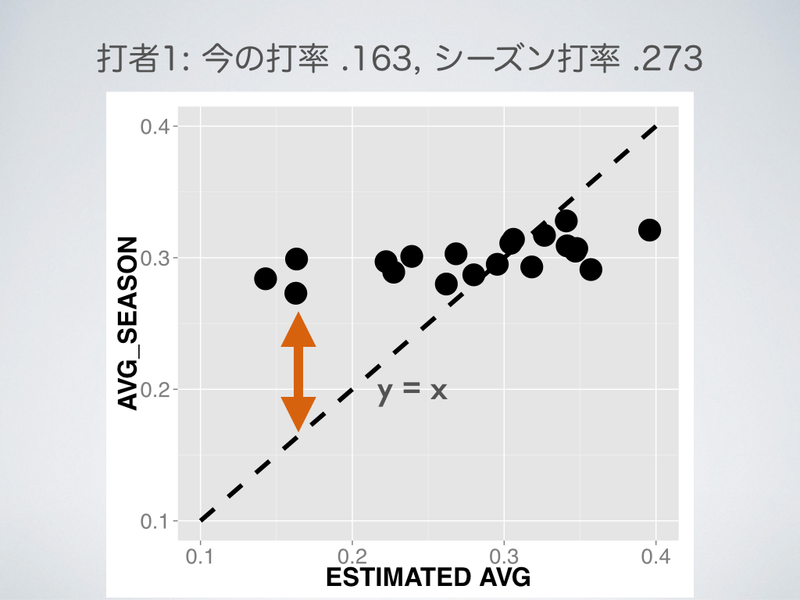
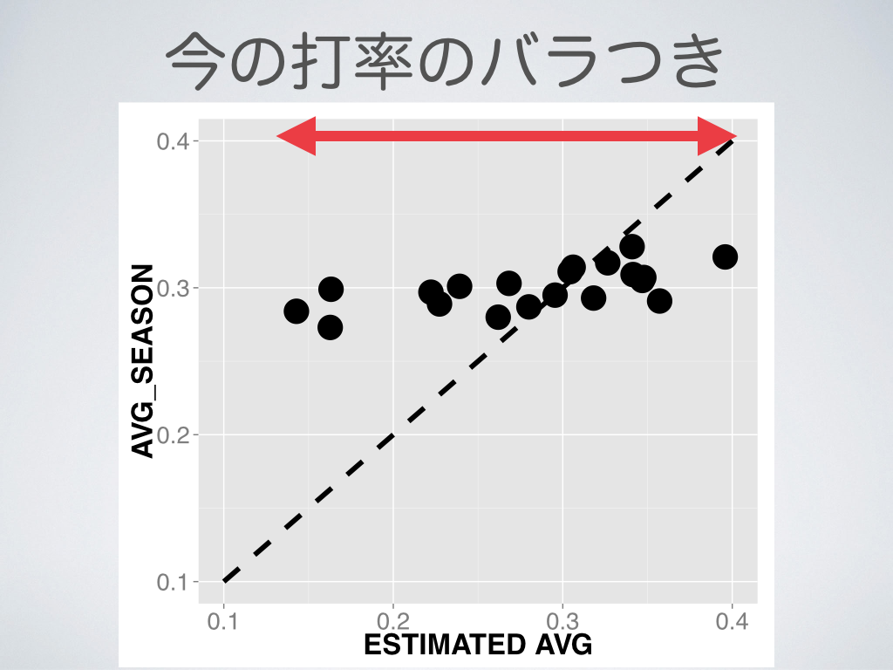
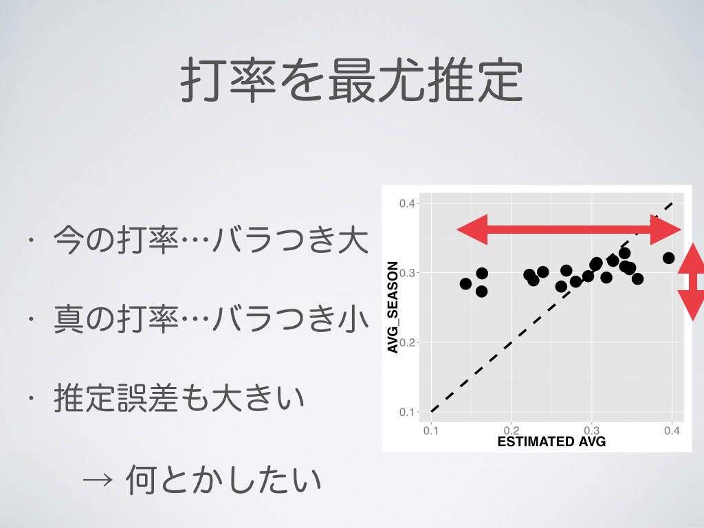
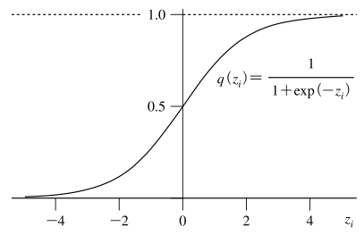

```{r global_option, echo=FALSE, error=FALSE, warning=FALSE}
opts_chunk$set(tidy=FALSE, message=FALSE, warning=FALSE)
```

<div style='text-align: center;'>
    
</div>

---
<div style='text-align: center;'>
    
</div>

---
<div style='text-align: center;'>
    
</div>

---
<div style='text-align: center;'>
    
</div>

---
## Outline 

### 1. 問題設定: シーズン打率を推定したい 

<br>

### 2. 最尤推定で打率推定

<br>

### 3. 階層ベイズモデルで打率推定

---

## 問題設定

### 2013年メジャーリーグ, 4月20日までのデータ

```{r echo = FALSE, results='asis'}
library(data.table)
library(ggplot2)
library(dplyr)
library(magrittr)
library(xtable)
dat_m_april = fread("dat_before_A20.csv")
dat_m_april %>% head(10) %>% 
  mutate(AVG_SEASON = round(AVG_SEASON, 3)) %>% 
  mutate(AVG = round(AVG, 3)) %>% 
  select(FULLNAME, ATBAT, HITS, AVG, AVG_SEASON) %>%
  xtable() %>% print(type="html")
```

Data : Major League Baseball Games (2013) ... Open Data

http://www.retrosheet.org/boxesetc/2013/Y_2013.htm

--- 

## 用語

### ATBAT : 試行回数

### HIT :  成功数

### AVG : 打率

### batter: 89人 (500打席以上)

<br>

```{r results='asis', echo=FALSE}
dat_m_april %>% head(5) %>% 
  mutate(AVG_SEASON = round(AVG_SEASON, 3)) %>% 
  mutate(AVG = round(AVG, 3)) %>% 
  select(FULLNAME, ATBAT, HITS, AVG, AVG_SEASON) %>%
  xtable() %>% print(type="html")
```

--- 
## 目次 

### 1. 問題設定: シーズン打率を推定したい 

<br>

### 2. 最尤推定で打率推定

<br>

### 3. 階層ベイズモデルで打率推定

---


## 打席結果にランダム性を仮定

<br>

Ex. イチローの打席結果 (April,2013)

HIT, OUT, OUT, HIT, OUT, HIT, OUT, OUT , OUT, ... 


<br>

$n$ 安打数 / $N$ 打席数 $\to$ 尤度 $\mathrm{L}(q)$: 

$$\begin{align*}
 \mathrm{L}(q) &= \binom{N}{n}q^n (1-q)^{N-n}.
\end{align*}$$

where $q$ : 真の打率
 
 $\to$ 真の打率を予測したい

---&twocol

## 最尤推定

*** =left

尤度: $\mathrm{L}(q)$:
$$\begin{align*}
 \mathrm{L}(q) = \binom{N}{n}q^n (1-q)^{N-n}.
\end{align*}$$

<br>

最尤推定量 $\hat{q}$:

$$\begin{align*}
 \hat{q} = \mathrm{argmax} ~ \mathrm{L}(q)
\end{align*}$$

*** =right

```{r echo = FALSE, out.width='\\textwidth',  fig.align='center'}
q = seq(0, 1, by = 0.01)
L = dbinom(37, 100, q)
dat = data.frame(q=q, L=L)
ggplot(dat, aes(x=q, y=L)) + geom_line(size=2) + ggtitle("Likelihood: L(q)") + 
  geom_vline(x=0.37, linetype="dashed", size = 2, color="red") +  
  theme(plot.title=element_text(size=24, face="bold"))
```

---&twocol

## 打率を最尤推定

*** =left

尤度 $\mathrm{L}(q)$:
$$\begin{align*}
 \mathrm{L}(q) = \binom{N}{n}q^n (1-q)^{N-n}.
\end{align*}$$

<br>

尤度を最大化するパラメータ...
$$\begin{align*}
\frac{\partial}{\partial q_i} \log \mathrm{L}(q_i) &= 0, \\
  \frac{n_i}{q_i} - \frac{N_i-n_i}{1-q_i} &= 0, \\ 
  \hat{q_i} &= \frac{n_i}{N_i}. 
\end{align*}$$

*** =right

```{r echo=FALSE, results='asis', out.width='\\textwidth',  fig.align='center'}
dat_for_plot = 
  dat_m_april %>% 
  mutate(AVG_SEASON = round(AVG_SEASON,3))
dat_for_plot %>% mutate(MLE = AVG) %>%
  select(FULLNAME, AVG, MLE, AVG_SEASON) %>%
  head(10) %>%
  xtable() %>% print(type="html")
```

---&twocol

## 打率を最尤推定

*** =left

```{r echo=FALSE, results='asis', out.width='\\textwidth',  fig.align='center', warning=FALSE}
dat_for_plot = dat_m_april %>% mutate(AVG_SEASON = round(AVG_SEASON,3))
dat_for_plot %>% 
  ggplot(aes(y=AVG_SEASON, x=AVG)) + geom_point(size = 4) + 
  stat_function(fun = function(x) x, colour = "black", linetype="dashed") + 
  xlab("ESTIMATED AVG") +
  theme(axis.text.x=element_text(size=20)) +
  theme(axis.text.y=element_text(size=20)) +
  theme(axis.title.x=element_text(size=24, face="bold")) +
  theme(axis.title.y=element_text(size=24, face="bold"))
```


*** =right

```{r echo=FALSE, results='asis', out.width='\\textwidth',  fig.align='center'}

dat_for_plot = dat_m_april %>% mutate(AVG_SEASON = round(AVG_SEASON,3))
dat_for_plot %>% mutate(MLE = AVG) %>%
  select(FULLNAME, AVG, MLE, AVG_SEASON) %>%
  head(10) %>%
  xtable() %>% print(type="html")
```

### ... 推定量の散らばりを抑えたい

---

<div style='text-align: center;'>
    
</div>


---
<div style='text-align: center;'>
    
</div>


---

<div style='text-align: center;'>
    
</div>


---
<div style='text-align: center;'>
    
</div>


---
<div style='text-align: center;'>
    
</div>


---
<div style='text-align: center;'>
    
</div>


---

<div style='text-align: center;'>
    
</div>


---
<div style='text-align: center;'>
    
</div>


---
<div style='text-align: center;'>
    
</div>


---

## 目次 

### 1. 問題設定: シーズン打率を推定したい 

<br>

### 2. 最尤推定で打率推定

<br>

### 3. 階層ベイズモデルで打率推定

---

## ベイズ推定

* 事前分布, 事後分布...
 * $P(D)$ : 打席結果$D$が得られる確率

 * $P(q_i)$ : $q_i$の事前分布.
 
 * $P(q_i | D)$ : $q_i$の事後分布.
 
<br>

### ベイズの公式
 
$$\begin{align*}
 \mathrm{P}(q_i ~ | ~ D) &= \frac{\mathrm{P}(D~|~q_i) \mathrm{P}(q_i)}{\mathrm{P}(D)} \\
 & \propto \mathrm{P}(D~|~q_i) \mathrm{P}(q_i).
\end{align*}$$

<br>

$\mathrm{P}(q_i)$  ... __"平均周りに縮小"__ させるような事前分布にしたい.

---

## ベイズ推定

$q_i$ 事後分布: 
$$\begin{align*}
\mathrm{P}(q_i | D) \propto \mathrm{P}(D|q_i)\mathrm{P}(q_i).\\
\end{align*}$$

打率 $q_i$ $\to$ 打者スキル $r_i$ 

$$ q_i = \frac{1}{1 + \mathrm{e}^{-r_i}}.$$

$r_i$ ... 打者スキル. 正規分布に従うと仮定. 

$$ r_i \sim \mathcal{N}(a,b).$$

$a$, $b$: 事前分布のパラメータ... どうやって決める?

---

<div style='text-align: center;'>
    
</div>

図は[久保, 2009]より


---

## ベイズ推定

$r_i$の事後分布: 
$$\begin{align*}
\mathrm{P}(r_i | D) &\propto \mathrm{P}(D|r_i)\mathrm{P}(r_i;a,b), \\
r_i &\sim \mathcal{N}(a,b).
\end{align*}$$

事前分布のパラメータ$a$, $b$ ... どうやって決める?


<br>

__2012__ 年のデータを使う?  .. $a = ~~~$, $b = ~~~$  ?

<br>

__2013__ 年のデータだけで何とかしたい

---
## 階層ベイズモデル

$r_i$の事後分布: $P(D|r_i)$
$$\begin{align*}
\mathrm{P}(q_i | D) \propto \mathrm{P}(D|q_i)\mathrm{P}(q_i).\\
\end{align*}$$

パラメータの変換

$$ q_i = \frac{1}{1 + \mathrm{e}^{-r_i}}.$$


$r_i$ : 打者スキル $\sim$ 正規分布

$$ r_i \sim \mathcal{N}(a,b).$$

### 無情報事前分布

$$\begin{align*}
a &\sim \mathcal{N}(0, 100^2), \\
b &\sim \mathcal{U}(0, 100).
\end{align*}$$

---

## 階層ベイズモデル

### モデル まとめ

$q_i$の事後分布: 
$$\begin{align*}
\mathrm{P}(q_i | D) &\propto \mathrm{P}(D|q_i)\mathrm{P}(q_i)\\
                    &= \mathrm{P}(D|r_i)\mathrm{P}(r_i)\\
                    &= \int \mathrm{P}(D|r_i)\mathrm{P}(r_i;a,b)\mathrm{P}(a)\mathrm{P}(b) ~ \mathrm{d}a\mathrm{d}b.
\end{align*}$$

where

$$\begin{align*}
& n_i \sim \mathcal{Binom}(N_i, q_i),\\
& q_i = \frac{1}{1 + \mathrm{e}^{-r_i}}, ~ r_i \sim \mathcal{N} (a,b),\\
& a \sim \mathcal{N}(0,100^2), ~ b \sim \mathcal{U}(0,100).
\end{align*}$$

~


---

## 階層ベイズモデル

### モデル まとめ 

$q_i$の事後分布: 
$$\begin{align*}
\mathrm{P}(q_i | D) &\propto \mathrm{P}(D|q_i)\mathrm{P}(q_i)\\
                    &= \mathrm{P}(D|r_i)\mathrm{P}(r_i)\\
                    &= \int \mathrm{P}(D|r_i)\mathrm{P}(r_i;a,b)\mathrm{P}(a)\mathrm{P}(b) ~ \mathrm{d}a\mathrm{d}b.
\end{align*}$$

where

$$\begin{align*}
& n_i \sim \mathcal{Binom}(N_i, q_i),\\
& q_i = \frac{1}{1 + \mathrm{e}^{-r_i}}, ~ r_i \sim \mathcal{N} (a,b),\\
& a \sim \mathcal{N}(0,100^2), ~ b \sim \mathcal{U}(0,100).
\end{align*}$$

... $\mathrm{P}(q_i|D)$ : 分布を解析的に計算するのは難しい ... $\to$ __StanでMCMCサンプリング__

---

## 結果

サンプリング $\sim \mathrm{P}(q_1 | D) \propto \int \mathrm{P}(D|r_1)\mathrm{P}(r_1|a,b)\mathrm{P}(a)\mathrm{P}(b) \mathrm{d}a\mathrm{d}b.$

```{r echo=FALSE, results='asis', out.width='\\textwidth', fig.align='center'}
param_data = fread("param.csv")
q1 = param_data[,1,with=FALSE] %>% setnames("q1")
ggplot(q1) + 
  geom_histogram(aes(x=q1), fill="white", stat="bin", color="black", binwidth=0.01) +
  ggtitle("Histogram of q_1") + 
  theme(plot.title=element_text(face="bold", size=24)) + 
  theme(legend.position="NULL")
```

---

## 結果

サンプリング $\sim \mathrm{P}(q_1 | D) \propto \int \mathrm{P}(D|r_1)\mathrm{P}(r_1|a,b)\mathrm{P}(a)\mathrm{P}(b) \mathrm{d}a\mathrm{d}b.$

```{r echo=FALSE, results='asis', out.width='\\textwidth', fig.align='center'}
ggplot(q1) + 
  geom_density(aes(x=q1)) + 
  ggtitle("Posterior distribution of q_1") + 
  theme(plot.title=element_text(face="bold", size=24)) + 
  theme(legend.position="NULL")
```
--- &twocol

## 結果

*** =left


```{r echo=FALSE, results='asis', out.width='\\textwidth', fig.align='center'}
library(reshape2)
data_stan = fread("avg_stan.csv")
data_stan %>% 
  dplyr::select(FULLNAME, MCMC, AVG_SEASON) %>% 
  setnames(c("FULLNAME","ESTIMATED_AVG", "AVG_SEASON")) %>% 
  head(11) %>% 
  xtable() %>% 
  print(type="html") 
```

最尤推定で得られた推定値

*** =right


```{r echo=FALSE, results='asis', out.width='\\textwidth', fig.align='center'}
library(reshape2)
data_stan = fread("avg_stan.csv")
data_stan %>% 
  dplyr::select(FULLNAME, MLE, AVG_SEASON, MCMC) %>% 
  ggplot(aes(y=AVG_SEASON, x=MCMC)) + 
  geom_point(size=4) +
  stat_function(fun=function(x) x, linetype="dashed") +
  ylab("AVG_SEASON") +
  ggtitle("HBM") + 
  xlab("Estimated AVG") +
  xlim(0.1,0.4) + 
  ylim(0.1,0.4) +
  theme(plot.title=element_text(size=26, face="bold"))+
  theme(axis.text.x=element_text(size=20)) +
  theme(axis.text.y=element_text(size=20)) +
  theme(axis.title.x=element_text(size=24, face="bold")) +
  theme(axis.title.y=element_text(size=24, face="bold"))
```

階層ベイズモデルで得られた事後分布の中央値

--- &twocol

## 結果

*** =left

```{r echo=FALSE, results='asis', out.width='\\textwidth', fig.align='center'}
library(reshape2)
data_stan = fread("avg_stan.csv")
data_stan %>% 
  dplyr::select(FULLNAME, MLE, AVG_SEASON, MCMC) %>% 
  ggplot(aes(y=AVG_SEASON, x=MLE)) + geom_point(size=4) +
  stat_function(fun=function(x) x, linetype="dashed") +
  ylab("AVG_SEASON") + ggtitle("MLE") + 
  xlab("Estimated AVG") +
  theme(plot.title=element_text(size=26, face="bold"))+
  theme(axis.text.x=element_text(size=20)) +
  theme(axis.text.y=element_text(size=20)) +
  theme(axis.title.x=element_text(size=24, face="bold")) +
  theme(axis.title.y=element_text(size=24, face="bold"))
```

*** =right

```{r echo=FALSE, results='asis', out.width='\\textwidth', fig.align='center'}
library(reshape2)
data_stan = fread("avg_stan.csv")
data_stan %>% 
  dplyr::select(FULLNAME, MLE, AVG_SEASON, MCMC) %>% 
  ggplot(aes(y=AVG_SEASON, x=MCMC)) + geom_point(size=4) +
  stat_function(fun=function(x) x, linetype="dashed") +
  ylab("AVG_SEASON") + ggtitle("HBM") + 
  xlab("Estimated AVG") + 
  xlim(0.1,0.4) + ylim(0.1,0.4)+
  theme(plot.title=element_text(size=26, face="bold"))+
  theme(axis.text.x=element_text(size=20)) +
  theme(axis.text.y=element_text(size=20)) +
  theme(axis.title.x=element_text(size=24, face="bold")) + 
  theme(axis.title.y=element_text(size=24, face="bold"))
```

---
## 結果

<!-- ```{r echo=FALSE, results='asis', out.width='\\textwidth', fig.align='center'} -->
```{r echo=FALSE, results='asis', out.width=550, fig.align='center'}
library(reshape2)
data_stan = fread("avg_stan.csv")
data_stan %>% 
  dplyr::select(FULLNAME, MLE, AVG_SEASON, MCMC) %>% 
  setnames(c("FULLNAME", "MLE", "AVG_SEASON", "HBM")) %>%
  reshape2::melt(id.var=c("FULLNAME", "AVG_SEASON")) %>% 
  ggplot(aes(y=AVG_SEASON, x=value, colour=variable)) + geom_point(size=4, alpha=0.8) +
  stat_function(fun=function(x) x, linetype="dashed") + 
  xlab("Estimated_AVG") + ylab("AVG_SEASON") + 
  ggtitle("MLE vs HBM") + 
  theme(plot.title=element_text(size=24, face="bold")) +
  theme(axis.text.x=element_text(size=20)) +
  theme(axis.text.y=element_text(size=20)) +
  theme(axis.title.x=element_text(size=24, face="bold")) +
  theme(axis.title.y=element_text(size=24, face="bold"))
```

--- &twocol

## 結果 

$$\text{Mean Absolute Error} = \frac{1}{N}\sum\limits \left| q_i - q_{\text{season}}\right|$$

*** =left

```{r echo=FALSE, results='asis', out.width='\\textwidth', fig.align='center'}
library(reshape2)
data_stan = fread("avg_stan.csv")
MLE_MAE = 
  data_stan %>% 
  mutate(MLE_ERROR = abs(AVG_SEASON - MLE)) %>% 
  summarise(mean(MLE_ERROR))
data_stan %>% 
  dplyr::select(FULLNAME, MLE, AVG_SEASON, MCMC) %>% 
  ggplot(aes(y=AVG_SEASON, x=MLE)) + geom_point(size=4) +
  stat_function(fun=function(x) x, linetype="dashed") +
  ylab("AVG_SEASON") + ggtitle(paste("MLE: MAE = ", round(MLE_MAE, 4))) + 
  xlab("Estimated AVG") +
  xlim(0.1,0.4) + ylim(0.1,0.4) +
  theme(plot.title=element_text(size=26, face="bold")) +
  theme(axis.text.x=element_text(size=20)) +
  theme(axis.text.y=element_text(size=20)) +
  theme(axis.title.x=element_text(size=24, face="bold")) +
  theme(axis.title.y=element_text(size=24, face="bold"))

N = dim(data_stan)[1]
# data_stan %>% mutate(dif = abs(MCMC - AVG_SEASON)) %>% dplyr::select(dif) %>% sum /N
```

*** =right

```{r echo=FALSE, results='asis', out.width='\\textwidth', fig.align='center'}
library(reshape2)
data_stan = fread("avg_stan.csv")

HBM_MAE = 
  data_stan %>% 
  mutate(HBM_ERROR = abs(AVG_SEASON - MCMC)) %>% 
  summarise(mean(HBM_ERROR))
data_stan %>% 
  dplyr::select(FULLNAME, MLE, AVG_SEASON, MCMC) %>% 
  ggplot(aes(y=AVG_SEASON, x=MCMC)) + geom_point(size=4) +
  stat_function(fun=function(x) x, linetype="dashed") +
  ylab("AVG_SEASON") + ggtitle(paste("HBM: MAE = ", round(HBM_MAE, 4))) + 
  xlab("Estimated AVG") +
  xlim(0.1,0.4) + ylim(0.1,0.4) +
  theme(plot.title=element_text(size=26, face="bold")) +
  theme(axis.text.x=element_text(size=20)) +
  theme(axis.text.y=element_text(size=20)) +
  theme(axis.title.x=element_text(size=24, face="bold")) +
  theme(axis.title.y=element_text(size=24, face="bold"))
N = dim(data_stan)[1]
# data_stan %>% mutate(dif = abs(MLE - AVG_SEASON)) %>% dplyr::select(dif) %>% sum /N
```

---&twocol

## 応用

*** =left

* 代打起用問題

 * 打者 A : 2安打 / 7打数
 * 打者 B : 20安打 / 70打数
 
<br>

$$\begin{align*}
\text{Exploitation} \leftrightarrow \text{Exploration}
\end{align*}$$

<br>

* 多腕バンディット問題に?
 *  __Upper-Confidence-Bound__ 

*** =right

```{r echo=FALSE, results='asis', out.width='\\textwidth', fig.align='center'}
# Confidence plot 39 and 27
bat1_y = c(0.05, 0.697)
bat2_y = c(0.187, 0.497)

low = c(0.05, 0.187)
high = c(0.697, 0.497)
bat1 = 2/7 
bat2 = 20/70
df = data.frame(bat1, bat2)
df = df %>% melt() 
df = data.frame(df, low, high)

ggplot(df, aes(variable)) + 
  geom_point(aes(x=variable, y=value), size=10) + 
  geom_errorbar(ymin=low, ymax=high) + 
  ggtitle(("Confidence Interval")) + 
  theme(plot.title=element_text(face="bold", size=24)) + 
  xlab("Batter") + ylab("AVG") +
  theme(axis.text.x=element_text(size=20)) +
  theme(axis.text.y=element_text(size=20)) +
  theme(axis.title.x=element_text(size=24, face="bold")) +
  theme(axis.title.y=element_text(size=24, face="bold"))
```

---&twocol

## 応用


*** =left
* 代打起用問題

 * 打者 A : 2安打/ 7打数
 * 打者 B : 20安打 / 70打数

<br>

$$\begin{align*}
\text{Exploitation} \leftrightarrow \text{Exploration}
\end{align*}$$

<br>

* 多腕バンディット問題
 * __Upper-Credible-Bound??__ 


*** =right

```{r echo=FALSE, results='asis', out.width='\\textwidth', fig.align='center'}
# Confidence plot 39 and 27

df = fread("param.csv")
df = df[,c(39,27),with=FALSE] %>% setnames(c("bat1","bat2"))
df_cred  = 
  df %>% summarise(bat1_upper = quantile(bat1, probs=0.95), 
                 bat1_lower = quantile(bat1, probs=0.05),
                 bat2_upper = quantile(bat2, probs=0.95), 
                 bat2_lower = quantile(bat2, probs=0.05), 
                 bat1_mean =  mean(bat1), 
                 bat2_mean = mean(bat2))

uppers = 
  df_cred %>%
  select(bat1_upper, bat2_upper) %>% 
  unlist
lowers = 
  df_cred %>%
  select(bat1_lower, bat2_lower) %>% 
  unlist
means = 
  df_cred %>%
  select(bat1_mean, bat2_mean) %>% 
  unlist
batters = c("bat1", "bat2")

df = data.frame(batter = batters, 
                low = lowers, 
                high= uppers, 
                mean = means)

ggplot(df, aes(batters)) + 
  geom_point(aes(x=batters, y=means), size=10) + 
  geom_errorbar(ymin=lowers, ymax=uppers) + 
  ggtitle(("Credible Interval")) + 
  ylim(0.15,0.4) + 
  theme(plot.title=element_text(face="bold", size=24)) + 
  xlab("Batter") + ylab("AVG") +
  theme(axis.text.x=element_text(size=20)) +
  theme(axis.text.y=element_text(size=20)) +
  theme(axis.title.x=element_text(size=24, face="bold")) +
  theme(axis.title.y=element_text(size=24, face="bold"))
```

---

## まとめ

~
 
 * 階層ベイズモデルで打率の推定をしました
  * 平均絶対誤差で精度を測ると, 最尤推定よりも良い
  * 平均周りに縮小しすぎに見える
  * モデルの改善がしたい


 * 改善のために... 
  * 打者スキルの正規性という仮定は, そんなに悪くなさそう
  * 打席結果を二項分布とする仮定も, そんなに悪くなさそう
  * ハイパーパラメータの事前分布? 
  * 助けて


--- 


## 参考文献

* Data
 * The information used here was obtained free of charge from and is copyrighted by Retrosheet.  Interested parties may contact Retrosheet at 20 Sunset Rd., Newark, DE 19711.
* Hierarchical Bayesian Model
 * 最近のベイズモデルの進展と応用 (久保, 2009)

---
