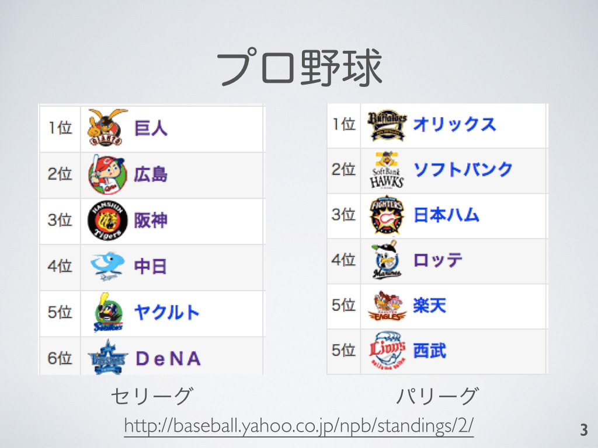
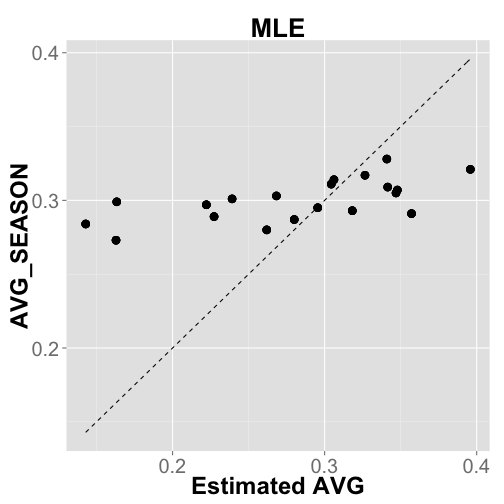
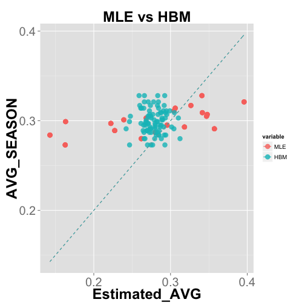
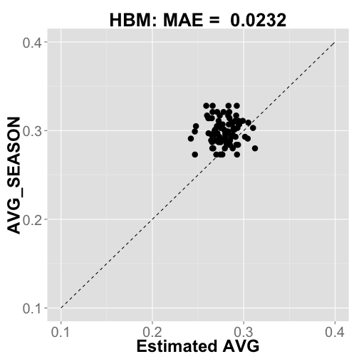
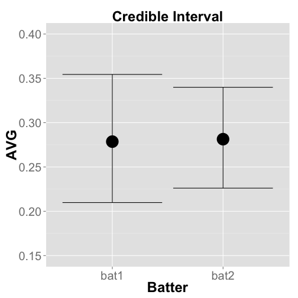

<div style='text-align: center;'>
    
</div>

---
<div style='text-align: center;'>
    
</div>

---
<div style='text-align: center;'>
    
</div>

---
<div style='text-align: center;'>
    
</div>

---
## Outline 

### 1. Problem: Predict the full-season Batting Average 

<br>

### 2. Predict Batting Average with Maximum Likelihood Estimation

<br>

### 3. Predict Batting Average with Hierarchical Bayes Model


---

## Problem

### Predict the __full-season__ AVG from data of __first 20 days of 2013 season (~ 4/20)__ 
<!-- html table generated in R 3.1.0 by xtable 1.7-3 package -->
<!-- Fri Jul 11 09:44:57 2014 -->
<TABLE border=1>
<TR> <TH>  </TH> <TH> FULLNAME </TH> <TH> ATBAT </TH> <TH> HITS </TH> <TH> AVG </TH> <TH> AVG_SEASON </TH>  </TR>
  <TR> <TD align="right"> 1 </TD> <TD> Pedro Alvarez </TD> <TD align="right">  52 </TD> <TD align="right">   6 </TD> <TD align="right"> 0.12 </TD> <TD align="right"> 0.23 </TD> </TR>
  <TR> <TD align="right"> 2 </TD> <TD> Elvis Andrus </TD> <TD align="right">  59 </TD> <TD align="right">  13 </TD> <TD align="right"> 0.22 </TD> <TD align="right"> 0.27 </TD> </TR>
  <TR> <TD align="right"> 3 </TD> <TD> Norichika Aoki </TD> <TD align="right">  61 </TD> <TD align="right">  18 </TD> <TD align="right"> 0.29 </TD> <TD align="right"> 0.29 </TD> </TR>
  <TR> <TD align="right"> 4 </TD> <TD> Erick Aybar </TD> <TD align="right">  28 </TD> <TD align="right">   9 </TD> <TD align="right"> 0.32 </TD> <TD align="right"> 0.27 </TD> </TR>
  <TR> <TD align="right"> 5 </TD> <TD> Darwin Barney </TD> <TD align="right">  11 </TD> <TD align="right">   1 </TD> <TD align="right"> 0.09 </TD> <TD align="right"> 0.21 </TD> </TR>
  <TR> <TD align="right"> 6 </TD> <TD> Adrian Beltre </TD> <TD align="right">  55 </TD> <TD align="right">  14 </TD> <TD align="right"> 0.26 </TD> <TD align="right"> 0.32 </TD> </TR>
  <TR> <TD align="right"> 7 </TD> <TD> Carlos Beltran </TD> <TD align="right">  51 </TD> <TD align="right">  13 </TD> <TD align="right"> 0.26 </TD> <TD align="right"> 0.30 </TD> </TR>
  <TR> <TD align="right"> 8 </TD> <TD> Michael Bourn </TD> <TD align="right">  45 </TD> <TD align="right">  15 </TD> <TD align="right"> 0.33 </TD> <TD align="right"> 0.26 </TD> </TR>
  <TR> <TD align="right"> 9 </TD> <TD> Michael Brantley </TD> <TD align="right">  50 </TD> <TD align="right">  12 </TD> <TD align="right"> 0.24 </TD> <TD align="right"> 0.28 </TD> </TR>
  <TR> <TD align="right"> 10 </TD> <TD> Jay Bruce </TD> <TD align="right">  71 </TD> <TD align="right">  21 </TD> <TD align="right"> 0.30 </TD> <TD align="right"> 0.26 </TD> </TR>
   </TABLE>

Data : Major League Baseball games (2013) ... Open Data

http://www.retrosheet.org/boxesetc/2013/Y_2013.htm


--- 

## Words

### ATBAT : number of trial 

### HIT :  number of success

### AVG : success rate

### batter: 89 batters (over 500 atbats)

<br>

<!-- html table generated in R 3.1.0 by xtable 1.7-3 package -->
<!-- Fri Jul 11 09:44:57 2014 -->
<TABLE border=1>
<TR> <TH>  </TH> <TH> FULLNAME </TH> <TH> ATBAT </TH> <TH> HITS </TH> <TH> AVG </TH> <TH> AVG_SEASON </TH>  </TR>
  <TR> <TD align="right"> 1 </TD> <TD> Pedro Alvarez </TD> <TD align="right">  52 </TD> <TD align="right">   6 </TD> <TD align="right"> 0.12 </TD> <TD align="right"> 0.23 </TD> </TR>
  <TR> <TD align="right"> 2 </TD> <TD> Elvis Andrus </TD> <TD align="right">  59 </TD> <TD align="right">  13 </TD> <TD align="right"> 0.22 </TD> <TD align="right"> 0.27 </TD> </TR>
  <TR> <TD align="right"> 3 </TD> <TD> Norichika Aoki </TD> <TD align="right">  61 </TD> <TD align="right">  18 </TD> <TD align="right"> 0.29 </TD> <TD align="right"> 0.29 </TD> </TR>
  <TR> <TD align="right"> 4 </TD> <TD> Erick Aybar </TD> <TD align="right">  28 </TD> <TD align="right">   9 </TD> <TD align="right"> 0.32 </TD> <TD align="right"> 0.27 </TD> </TR>
  <TR> <TD align="right"> 5 </TD> <TD> Darwin Barney </TD> <TD align="right">  11 </TD> <TD align="right">   1 </TD> <TD align="right"> 0.09 </TD> <TD align="right"> 0.21 </TD> </TR>
   </TABLE>

--- 
## Outline 

### 1. Problem: Predict the full-season Batting Average 

<br>

### 2. Predict Batting Average with Maximum Likelihood Estimation

<br>

### 3. Predict Batting Average with Hierarchical Bayes Model

---


## Randomness

<br>

Ex. Batting Result of Ichiro (April,2013)

HIT, OUT, OUT, HIT, OUT, HIT, OUT, OUT , OUT, ... 


<br>

$n$ hits / $N$ atbats $\to$ Likelihood $\mathrm{L}(q)$: 

$$\begin{align*}
 \mathrm{L}(q) &= \binom{N}{n}q^n (1-q)^{N-n}.
\end{align*}$$

where $q$ is the true Batting Average.

 
 $\to$ Predict Batting Average

---&twocol

## Maximum Likelihood Estimation

*** =left

Likelihood $\mathrm{L}(q)$:
$$\begin{align*}
 \mathrm{L}(q) = \binom{N}{n}q^n (1-q)^{N-n}.
\end{align*}$$

<br>

Estimated parameter value $\hat{q}$:

$$\begin{align*}
 \hat{q} = \mathrm{argmax} ~ \mathrm{L}(q)
\end{align*}$$

*** =right


---&twocol

## Maximum Likelihood Estimation

*** =left

Likelihood $\mathrm{L}(q)$:
$$\begin{align*}
 \mathrm{L}(q) = \binom{N}{n}q^n (1-q)^{N-n}.
\end{align*}$$

<br>

Solve
$$\begin{align*}
\frac{\partial}{\partial q_i} \log \mathrm{L}(q_i) &= 0, \\
  \frac{n_i}{q_i} - \frac{N_i-n_i}{1-q_i} &= 0, \\ 
  \hat{q_i} &= \frac{n_i}{N_i}. 
\end{align*}$$
*** =right

<!-- html table generated in R 3.1.0 by xtable 1.7-3 package -->
<!-- Fri Jul 11 09:44:57 2014 -->
<TABLE border=1>
<TR> <TH>  </TH> <TH> FULLNAME </TH> <TH> AVG </TH> <TH> MLE </TH> <TH> AVG_SEASON </TH>  </TR>
  <TR> <TD align="right"> 1 </TD> <TD> Pedro Alvarez </TD> <TD align="right"> 0.12 </TD> <TD align="right"> 0.12 </TD> <TD align="right"> 0.23 </TD> </TR>
  <TR> <TD align="right"> 2 </TD> <TD> Elvis Andrus </TD> <TD align="right"> 0.22 </TD> <TD align="right"> 0.22 </TD> <TD align="right"> 0.27 </TD> </TR>
  <TR> <TD align="right"> 3 </TD> <TD> Norichika Aoki </TD> <TD align="right"> 0.30 </TD> <TD align="right"> 0.30 </TD> <TD align="right"> 0.29 </TD> </TR>
  <TR> <TD align="right"> 4 </TD> <TD> Erick Aybar </TD> <TD align="right"> 0.32 </TD> <TD align="right"> 0.32 </TD> <TD align="right"> 0.27 </TD> </TR>
  <TR> <TD align="right"> 5 </TD> <TD> Darwin Barney </TD> <TD align="right"> 0.09 </TD> <TD align="right"> 0.09 </TD> <TD align="right"> 0.21 </TD> </TR>
  <TR> <TD align="right"> 6 </TD> <TD> Adrian Beltre </TD> <TD align="right"> 0.25 </TD> <TD align="right"> 0.25 </TD> <TD align="right"> 0.32 </TD> </TR>
  <TR> <TD align="right"> 7 </TD> <TD> Carlos Beltran </TD> <TD align="right"> 0.25 </TD> <TD align="right"> 0.25 </TD> <TD align="right"> 0.30 </TD> </TR>
  <TR> <TD align="right"> 8 </TD> <TD> Michael Bourn </TD> <TD align="right"> 0.33 </TD> <TD align="right"> 0.33 </TD> <TD align="right"> 0.26 </TD> </TR>
  <TR> <TD align="right"> 9 </TD> <TD> Michael Brantley </TD> <TD align="right"> 0.24 </TD> <TD align="right"> 0.24 </TD> <TD align="right"> 0.28 </TD> </TR>
  <TR> <TD align="right"> 10 </TD> <TD> Jay Bruce </TD> <TD align="right"> 0.30 </TD> <TD align="right"> 0.30 </TD> <TD align="right"> 0.26 </TD> </TR>
   </TABLE>

---&twocol

## Maximum Likelihood Estimation

*** =left


*** =right

<!-- html table generated in R 3.1.0 by xtable 1.7-3 package -->
<!-- Fri Jul 11 09:44:57 2014 -->
<TABLE border=1>
<TR> <TH>  </TH> <TH> FULLNAME </TH> <TH> AVG </TH> <TH> MLE </TH> <TH> AVG_SEASON </TH>  </TR>
  <TR> <TD align="right"> 1 </TD> <TD> Pedro Alvarez </TD> <TD align="right"> 0.12 </TD> <TD align="right"> 0.12 </TD> <TD align="right"> 0.23 </TD> </TR>
  <TR> <TD align="right"> 2 </TD> <TD> Elvis Andrus </TD> <TD align="right"> 0.22 </TD> <TD align="right"> 0.22 </TD> <TD align="right"> 0.27 </TD> </TR>
  <TR> <TD align="right"> 3 </TD> <TD> Norichika Aoki </TD> <TD align="right"> 0.30 </TD> <TD align="right"> 0.30 </TD> <TD align="right"> 0.29 </TD> </TR>
  <TR> <TD align="right"> 4 </TD> <TD> Erick Aybar </TD> <TD align="right"> 0.32 </TD> <TD align="right"> 0.32 </TD> <TD align="right"> 0.27 </TD> </TR>
  <TR> <TD align="right"> 5 </TD> <TD> Darwin Barney </TD> <TD align="right"> 0.09 </TD> <TD align="right"> 0.09 </TD> <TD align="right"> 0.21 </TD> </TR>
  <TR> <TD align="right"> 6 </TD> <TD> Adrian Beltre </TD> <TD align="right"> 0.25 </TD> <TD align="right"> 0.25 </TD> <TD align="right"> 0.32 </TD> </TR>
  <TR> <TD align="right"> 7 </TD> <TD> Carlos Beltran </TD> <TD align="right"> 0.25 </TD> <TD align="right"> 0.25 </TD> <TD align="right"> 0.30 </TD> </TR>
  <TR> <TD align="right"> 8 </TD> <TD> Michael Bourn </TD> <TD align="right"> 0.33 </TD> <TD align="right"> 0.33 </TD> <TD align="right"> 0.26 </TD> </TR>
  <TR> <TD align="right"> 9 </TD> <TD> Michael Brantley </TD> <TD align="right"> 0.24 </TD> <TD align="right"> 0.24 </TD> <TD align="right"> 0.28 </TD> </TR>
  <TR> <TD align="right"> 10 </TD> <TD> Jay Bruce </TD> <TD align="right"> 0.30 </TD> <TD align="right"> 0.30 </TD> <TD align="right"> 0.26 </TD> </TR>
   </TABLE>

### ... How can we Shrink the value to mean?

---

<div style='text-align: center;'>
    
</div>


---
<div style='text-align: center;'>
    
</div>


---

<div style='text-align: center;'>
    
</div>


---
<div style='text-align: center;'>
    
</div>


---
<div style='text-align: center;'>
    
</div>


---
<div style='text-align: center;'>
    
</div>


---

<div style='text-align: center;'>
    
</div>


---
<div style='text-align: center;'>
    
</div>


---
<div style='text-align: center;'>
    
</div>


---

## Outline 

### 1. Problem: Predict the full-season Batting Average 

<br>

### 2. Test the ramdomness of the time series of Batting Results

<br>

### 3. Predict Batting Average with Maximum Likelihood Estimation

<br>

### 4. Predict Batting Average with Hierarchical Bayes Model


---

## Bayesian Estimation 

* Prior and Posterior distribution...
 * $P(D)$ : Prob. we obtain data $D$.

 * $P(q_i)$ : Prior of parameter $q_i$.
 
 * $P(q_i | D)$ : Posterior.
 
<br>

### Bayesian Formula : 
 
$$\begin{align*}
 \mathrm{P}(q_i ~ | ~ D) &= \frac{\mathrm{P}(D~|~q_i) \mathrm{P}(q_i)}{\mathrm{P}(D)} \\
 & \propto \mathrm{P}(D~|~q_i) \mathrm{P}(q_i).
\end{align*}$$

<br>

Set the Prior $\mathrm{P}(q_i)$ which reflects __"shrink to mean"__.

---

## Bayesian Estimation

The Posterior of parameter $q_i$: 
$$\begin{align*}
\mathrm{P}(q_i | D) \propto \mathrm{P}(D|q_i)\mathrm{P}(q_i).\\
\end{align*}$$

Transform $q_i \left(\in [0,1]\right)$ to $r_i \left(\in [-\infty, \infty]\right)$ 

$$ q_i = \frac{1}{1 + \mathrm{e}^{-r_i}}.$$


$r_i$ ... Batting skill : normal distribution.

$$ r_i \sim \mathcal{N}(a,b).$$

$a$, $b$: hyper parameter ...

---

## Bayesian Estimation 

The Posterior of parameter $r_i$: 
$$\begin{align*}
\mathrm{P}(r_i | D) &\propto \mathrm{P}(D|r_i)\mathrm{P}(r_i;a,b), \\
r_i &\sim \mathcal{N}(a,b).
\end{align*}$$

How parameter $a$, $b$ is obtained? 


<br>

From __2012__ MLB Data ... $a = ~~~$, $b = ~~~$  ?

<br>

What can we do only with __2013__ data?

---
## Hierarchical Bayes Model

The Posterior of parameter $q_i$: 
$$\begin{align*}
\mathrm{P}(q_i | D) \propto \mathrm{P}(D|q_i)\mathrm{P}(q_i).\\
\end{align*}$$

Transform

$$ q_i = \frac{1}{1 + \mathrm{e}^{-r_i}}.$$


$r_i$ : Batting skill $\sim$ normal distribution.

$$ r_i \sim \mathcal{N}(a,b).$$

### Non-informative prior distribution

$$\begin{align*}
a &\sim \mathcal{N}(0, 100^2), \\
b &\sim \mathcal{U}(0, 100).
\end{align*}$$

---


## Hierarchical Bayes Model

### Summary: 

The Posterior of parameter $q_i$: 
$$\begin{align*}
\mathrm{P}(q_i | D) &\propto \mathrm{P}(D|q_i)\mathrm{P}(q_i)\\
                    &= \mathrm{P}(D|r_i)\mathrm{P}(r_i)\\
                    &= \int \mathrm{P}(D|r_i)\mathrm{P}(r_i;a,b)\mathrm{P}(a)\mathrm{P}(b) ~ \mathrm{d}a\mathrm{d}b.
\end{align*}$$

where

$$\begin{align*}
& n_i \sim \mathcal{Binom}(N_i, q_i),\\
& q_i = \frac{1}{1 + \mathrm{e}^{-r_i}}, ~ r_i \sim \mathcal{N} (a,b),\\
& a \sim \mathcal{N}(0,100^2), ~ b \sim \mathcal{U}(0,100).
\end{align*}$$

~


---

## Hierarchical Bayes Model

### Summary: 

The Posterior of parameter $q_i$: 
$$\begin{align*}
\mathrm{P}(q_i | D) &\propto \mathrm{P}(D|q_i)\mathrm{P}(q_i)\\
                    &= \mathrm{P}(D|r_i)\mathrm{P}(r_i)\\
                    &= \int \mathrm{P}(D|r_i)\mathrm{P}(r_i;a,b)\mathrm{P}(a)\mathrm{P}(b) ~ \mathrm{d}a\mathrm{d}b.
\end{align*}$$

where

$$\begin{align*}
& n_i \sim \mathcal{Binom}(N_i, q_i),\\
& q_i = \frac{1}{1 + \mathrm{e}^{-r_i}}, ~ r_i \sim \mathcal{N} (a,b),\\
& a \sim \mathcal{N}(0,100^2), ~ b \sim \mathcal{U}(0,100).
\end{align*}$$

... $\mathrm{P}(q_i|D)$ : analytic calculation is difficult ... $\to$ __Marcov-Chain-Monte-Carlo sampling__

---

## Result

Random Sampling $\sim \mathrm{P}(q_1 | D) \propto \int \mathrm{P}(D|r_1)\mathrm{P}(r_1|a,b)\mathrm{P}(a)\mathrm{P}(b) \mathrm{d}a\mathrm{d}b.$


---

## Result

Random Sampling $\sim \mathrm{P}(q_1 | D) \propto \int \mathrm{P}(D|r_1)\mathrm{P}(r_1|a,b)\mathrm{P}(a)\mathrm{P}(b) \mathrm{d}a\mathrm{d}b.$


--- &twocol

## Result 

*** =left

<!-- html table generated in R 3.1.0 by xtable 1.7-3 package -->
<!-- Fri Jul 11 09:44:58 2014 -->
<TABLE border=1>
<TR> <TH>  </TH> <TH> FULLNAME </TH> <TH> ESTIMATED_AVG </TH> <TH> AVG_SEASON </TH>  </TR>
  <TR> <TD align="right"> 1 </TD> <TD> Pedro Alvarez </TD> <TD align="right"> 0.25 </TD> <TD align="right"> 0.23 </TD> </TR>
  <TR> <TD align="right"> 2 </TD> <TD> Elvis Andrus </TD> <TD align="right"> 0.27 </TD> <TD align="right"> 0.27 </TD> </TR>
  <TR> <TD align="right"> 3 </TD> <TD> Norichika Aoki </TD> <TD align="right"> 0.28 </TD> <TD align="right"> 0.29 </TD> </TR>
  <TR> <TD align="right"> 4 </TD> <TD> Erick Aybar </TD> <TD align="right"> 0.28 </TD> <TD align="right"> 0.27 </TD> </TR>
  <TR> <TD align="right"> 5 </TD> <TD> Darwin Barney </TD> <TD align="right"> 0.27 </TD> <TD align="right"> 0.21 </TD> </TR>
  <TR> <TD align="right"> 6 </TD> <TD> Adrian Beltre </TD> <TD align="right"> 0.27 </TD> <TD align="right"> 0.32 </TD> </TR>
  <TR> <TD align="right"> 7 </TD> <TD> Carlos Beltran </TD> <TD align="right"> 0.27 </TD> <TD align="right"> 0.30 </TD> </TR>
  <TR> <TD align="right"> 8 </TD> <TD> Michael Bourn </TD> <TD align="right"> 0.29 </TD> <TD align="right"> 0.26 </TD> </TR>
  <TR> <TD align="right"> 9 </TD> <TD> Michael Brantley </TD> <TD align="right"> 0.27 </TD> <TD align="right"> 0.28 </TD> </TR>
  <TR> <TD align="right"> 10 </TD> <TD> Jay Bruce </TD> <TD align="right"> 0.28 </TD> <TD align="right"> 0.26 </TD> </TR>
  <TR> <TD align="right"> 11 </TD> <TD> Billy Butler </TD> <TD align="right"> 0.27 </TD> <TD align="right"> 0.29 </TD> </TR>
   </TABLE>

*** =right


--- &twocol

## Result 

*** =left



*** =right


---
## Result

<!-- ```{r echo=FALSE, results='asis', out.width='\\textwidth', fig.align='center'} -->


--- &twocol

## Result 

$$\text{Mean Absolute Error} = \frac{1}{N}\sum\limits \left| q_i - q_{\text{season}}\right|$$

*** =left


*** =right



---&twocol

## Application

*** =left

* Pinch-hitter selection 

 * Batter A : 2 hits / 7 atbats
 * Batter B : 20 hits / 70 atbats
 
<br>

$$\begin{align*}
\text{Exploitation} \leftrightarrow \text{Exploration}
\end{align*}$$

<br>

* Multi-Armed Bandit Problem
 *  Higher __Upper-Confidence-Bound__ batter


*** =right


---&twocol

## Application


*** =left
* Pinch-hitter selection 

 * batter A : 2 hits / 7 atbats
 * batter B : 20 hits / 70 atbats

<br>

$$\begin{align*}
\text{Exploitation} \leftrightarrow \text{Exploration}
\end{align*}$$

<br>

* Multi-Armed Bandit Problem 
 * Higher __Upper-Credible-Bound__ batter?


*** =right
ここをちゃんと区間に書きなおした方がいい



---

## Summary

 * Testing Randomness by Surrogate data method
  * Hit/Out series $=$ Coin-Tossing?
  * most of batters has randomness
 
 * Estimating AVG by Hierarchical Bayes model 
  * HBM is better than MLE in terms of MAE
  * Application: Pinch hitter selection $\sim$ Multi-Armed Bandit Problem
  * Improve the model

--- 

## Future Work
 * not-random batters
 * Hyper parameter ... Empirical Bayes method
 
---

---

## Reference

* Data
 * The information used here was obtained free of charge from and is copyrighted by Retrosheet.  Interested parties may contact Retrosheet at 20 Sunset Rd., Newark, DE 19711.

* Surrogate data method
 * カオス時系列解析の基礎と応用, 合原一幸(編), 池口徴, 山田泰司, 小室元政(著), 産業図書(2000). 
 
* Hierarchical Bayesian Model
 * Gelman, Andrew. "Prior distributions for variance parameters in hierarchical models (comment on article by Browne and Draper)." Bayesian analysis 1.3 (2006): 515-534.


---

## Announce

### I got the promise of job offer! 

---
