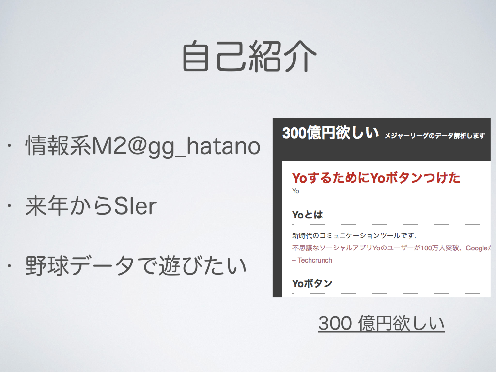
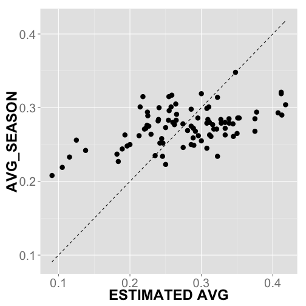
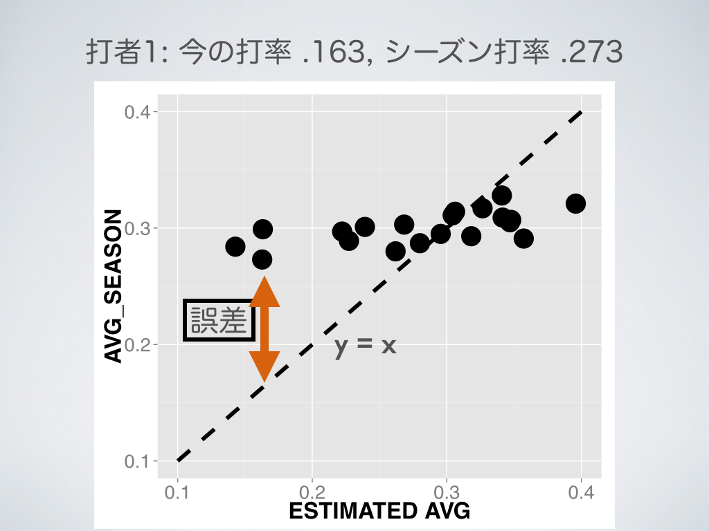

<div style='text-align: center;'>
    
</div>

---
<div style='text-align: center;'>
    
</div>

---
<div style='text-align: center;'>
    
</div>

---
<div style='text-align: center;'>
    
</div>

---
## Outline 

### 1. 問題設定: シーズン打率を推定したい 

<br>

### 2. 最尤推定で打率推定

<br>

### 3. 階層ベイズモデルで打率推定

---

## 問題設定

### 2013年メジャーリーグ, 4月20日までのデータ

<!-- html table generated in R 3.1.0 by xtable 1.7-3 package -->
<!-- Sat Jul 12 10:11:22 2014 -->
<TABLE border=1>
<TR> <TH>  </TH> <TH> FULLNAME </TH> <TH> ATBAT </TH> <TH> HITS </TH> <TH> AVG </TH> <TH> AVG_SEASON </TH>  </TR>
  <TR> <TD align="right"> 1 </TD> <TD> Pedro Alvarez </TD> <TD align="right">  52 </TD> <TD align="right">   6 </TD> <TD align="right"> 0.12 </TD> <TD align="right"> 0.23 </TD> </TR>
  <TR> <TD align="right"> 2 </TD> <TD> Elvis Andrus </TD> <TD align="right">  59 </TD> <TD align="right">  13 </TD> <TD align="right"> 0.22 </TD> <TD align="right"> 0.27 </TD> </TR>
  <TR> <TD align="right"> 3 </TD> <TD> Norichika Aoki </TD> <TD align="right">  61 </TD> <TD align="right">  18 </TD> <TD align="right"> 0.29 </TD> <TD align="right"> 0.29 </TD> </TR>
  <TR> <TD align="right"> 4 </TD> <TD> Erick Aybar </TD> <TD align="right">  28 </TD> <TD align="right">   9 </TD> <TD align="right"> 0.32 </TD> <TD align="right"> 0.27 </TD> </TR>
  <TR> <TD align="right"> 5 </TD> <TD> Darwin Barney </TD> <TD align="right">  11 </TD> <TD align="right">   1 </TD> <TD align="right"> 0.09 </TD> <TD align="right"> 0.21 </TD> </TR>
  <TR> <TD align="right"> 6 </TD> <TD> Adrian Beltre </TD> <TD align="right">  55 </TD> <TD align="right">  14 </TD> <TD align="right"> 0.26 </TD> <TD align="right"> 0.32 </TD> </TR>
  <TR> <TD align="right"> 7 </TD> <TD> Carlos Beltran </TD> <TD align="right">  51 </TD> <TD align="right">  13 </TD> <TD align="right"> 0.26 </TD> <TD align="right"> 0.30 </TD> </TR>
  <TR> <TD align="right"> 8 </TD> <TD> Michael Bourn </TD> <TD align="right">  45 </TD> <TD align="right">  15 </TD> <TD align="right"> 0.33 </TD> <TD align="right"> 0.26 </TD> </TR>
  <TR> <TD align="right"> 9 </TD> <TD> Michael Brantley </TD> <TD align="right">  50 </TD> <TD align="right">  12 </TD> <TD align="right"> 0.24 </TD> <TD align="right"> 0.28 </TD> </TR>
  <TR> <TD align="right"> 10 </TD> <TD> Jay Bruce </TD> <TD align="right">  71 </TD> <TD align="right">  21 </TD> <TD align="right"> 0.30 </TD> <TD align="right"> 0.26 </TD> </TR>
   </TABLE>

Data : Major League Baseball Games (2013) ... Open Data

http://www.retrosheet.org/boxesetc/2013/Y_2013.htm

--- 

## 用語

### ATBAT : 試行回数

### HIT :  成功数

### AVG : 打率

### batter: 89人 (500打席以上)

<br>

<!-- html table generated in R 3.1.0 by xtable 1.7-3 package -->
<!-- Sat Jul 12 10:11:22 2014 -->
<TABLE border=1>
<TR> <TH>  </TH> <TH> FULLNAME </TH> <TH> ATBAT </TH> <TH> HITS </TH> <TH> AVG </TH> <TH> AVG_SEASON </TH>  </TR>
  <TR> <TD align="right"> 1 </TD> <TD> Pedro Alvarez </TD> <TD align="right">  52 </TD> <TD align="right">   6 </TD> <TD align="right"> 0.12 </TD> <TD align="right"> 0.23 </TD> </TR>
  <TR> <TD align="right"> 2 </TD> <TD> Elvis Andrus </TD> <TD align="right">  59 </TD> <TD align="right">  13 </TD> <TD align="right"> 0.22 </TD> <TD align="right"> 0.27 </TD> </TR>
  <TR> <TD align="right"> 3 </TD> <TD> Norichika Aoki </TD> <TD align="right">  61 </TD> <TD align="right">  18 </TD> <TD align="right"> 0.29 </TD> <TD align="right"> 0.29 </TD> </TR>
  <TR> <TD align="right"> 4 </TD> <TD> Erick Aybar </TD> <TD align="right">  28 </TD> <TD align="right">   9 </TD> <TD align="right"> 0.32 </TD> <TD align="right"> 0.27 </TD> </TR>
  <TR> <TD align="right"> 5 </TD> <TD> Darwin Barney </TD> <TD align="right">  11 </TD> <TD align="right">   1 </TD> <TD align="right"> 0.09 </TD> <TD align="right"> 0.21 </TD> </TR>
   </TABLE>

--- 
## 目次 

### 1. 問題設定: シーズン打率を推定したい 

<br>

### 2. 最尤推定で打率推定

<br>

### 3. 階層ベイズモデルで打率推定

---


## 打席結果にランダム性を仮定

<br>

Ex. イチローの打席結果 (April,2013)

HIT, OUT, OUT, HIT, OUT, HIT, OUT, OUT , OUT, ... 


<br>

$n$ 安打数 / $N$ 打席数 $\to$ 尤度 $\mathrm{L}(q)$: 

$$\begin{align*}
 \mathrm{L}(q) &= \binom{N}{n}q^n (1-q)^{N-n}.
\end{align*}$$

where $q$ : 真の打率
 
 $\to$ 真の打率を予測したい

---&twocol

## 最尤推定

*** =left

尤度: $\mathrm{L}(q)$:
$$\begin{align*}
 \mathrm{L}(q) = \binom{N}{n}q^n (1-q)^{N-n}.
\end{align*}$$

<br>

最尤推定量 $\hat{q}$:

$$\begin{align*}
 \hat{q} = \mathrm{argmax} ~ \mathrm{L}(q)
\end{align*}$$

*** =right


---&twocol

## 打率を最尤推定

*** =left

尤度 $\mathrm{L}(q)$:
$$\begin{align*}
 \mathrm{L}(q) = \binom{N}{n}q^n (1-q)^{N-n}.
\end{align*}$$

<br>

尤度を最大化するパラメータ...
$$\begin{align*}
\frac{\partial}{\partial q_i} \log \mathrm{L}(q_i) &= 0, \\
  \frac{n_i}{q_i} - \frac{N_i-n_i}{1-q_i} &= 0, \\ 
  \hat{q_i} &= \frac{n_i}{N_i}. 
\end{align*}$$

*** =right

<!-- html table generated in R 3.1.0 by xtable 1.7-3 package -->
<!-- Sat Jul 12 10:11:22 2014 -->
<TABLE border=1>
<TR> <TH>  </TH> <TH> FULLNAME </TH> <TH> AVG </TH> <TH> MLE </TH> <TH> AVG_SEASON </TH>  </TR>
  <TR> <TD align="right"> 1 </TD> <TD> Pedro Alvarez </TD> <TD align="right"> 0.12 </TD> <TD align="right"> 0.12 </TD> <TD align="right"> 0.23 </TD> </TR>
  <TR> <TD align="right"> 2 </TD> <TD> Elvis Andrus </TD> <TD align="right"> 0.22 </TD> <TD align="right"> 0.22 </TD> <TD align="right"> 0.27 </TD> </TR>
  <TR> <TD align="right"> 3 </TD> <TD> Norichika Aoki </TD> <TD align="right"> 0.30 </TD> <TD align="right"> 0.30 </TD> <TD align="right"> 0.29 </TD> </TR>
  <TR> <TD align="right"> 4 </TD> <TD> Erick Aybar </TD> <TD align="right"> 0.32 </TD> <TD align="right"> 0.32 </TD> <TD align="right"> 0.27 </TD> </TR>
  <TR> <TD align="right"> 5 </TD> <TD> Darwin Barney </TD> <TD align="right"> 0.09 </TD> <TD align="right"> 0.09 </TD> <TD align="right"> 0.21 </TD> </TR>
  <TR> <TD align="right"> 6 </TD> <TD> Adrian Beltre </TD> <TD align="right"> 0.25 </TD> <TD align="right"> 0.25 </TD> <TD align="right"> 0.32 </TD> </TR>
  <TR> <TD align="right"> 7 </TD> <TD> Carlos Beltran </TD> <TD align="right"> 0.25 </TD> <TD align="right"> 0.25 </TD> <TD align="right"> 0.30 </TD> </TR>
  <TR> <TD align="right"> 8 </TD> <TD> Michael Bourn </TD> <TD align="right"> 0.33 </TD> <TD align="right"> 0.33 </TD> <TD align="right"> 0.26 </TD> </TR>
  <TR> <TD align="right"> 9 </TD> <TD> Michael Brantley </TD> <TD align="right"> 0.24 </TD> <TD align="right"> 0.24 </TD> <TD align="right"> 0.28 </TD> </TR>
  <TR> <TD align="right"> 10 </TD> <TD> Jay Bruce </TD> <TD align="right"> 0.30 </TD> <TD align="right"> 0.30 </TD> <TD align="right"> 0.26 </TD> </TR>
   </TABLE>

---&twocol

## 打率を最尤推定

*** =left




*** =right

<!-- html table generated in R 3.1.0 by xtable 1.7-3 package -->
<!-- Sat Jul 12 10:11:22 2014 -->
<TABLE border=1>
<TR> <TH>  </TH> <TH> FULLNAME </TH> <TH> AVG </TH> <TH> MLE </TH> <TH> AVG_SEASON </TH>  </TR>
  <TR> <TD align="right"> 1 </TD> <TD> Pedro Alvarez </TD> <TD align="right"> 0.12 </TD> <TD align="right"> 0.12 </TD> <TD align="right"> 0.23 </TD> </TR>
  <TR> <TD align="right"> 2 </TD> <TD> Elvis Andrus </TD> <TD align="right"> 0.22 </TD> <TD align="right"> 0.22 </TD> <TD align="right"> 0.27 </TD> </TR>
  <TR> <TD align="right"> 3 </TD> <TD> Norichika Aoki </TD> <TD align="right"> 0.30 </TD> <TD align="right"> 0.30 </TD> <TD align="right"> 0.29 </TD> </TR>
  <TR> <TD align="right"> 4 </TD> <TD> Erick Aybar </TD> <TD align="right"> 0.32 </TD> <TD align="right"> 0.32 </TD> <TD align="right"> 0.27 </TD> </TR>
  <TR> <TD align="right"> 5 </TD> <TD> Darwin Barney </TD> <TD align="right"> 0.09 </TD> <TD align="right"> 0.09 </TD> <TD align="right"> 0.21 </TD> </TR>
  <TR> <TD align="right"> 6 </TD> <TD> Adrian Beltre </TD> <TD align="right"> 0.25 </TD> <TD align="right"> 0.25 </TD> <TD align="right"> 0.32 </TD> </TR>
  <TR> <TD align="right"> 7 </TD> <TD> Carlos Beltran </TD> <TD align="right"> 0.25 </TD> <TD align="right"> 0.25 </TD> <TD align="right"> 0.30 </TD> </TR>
  <TR> <TD align="right"> 8 </TD> <TD> Michael Bourn </TD> <TD align="right"> 0.33 </TD> <TD align="right"> 0.33 </TD> <TD align="right"> 0.26 </TD> </TR>
  <TR> <TD align="right"> 9 </TD> <TD> Michael Brantley </TD> <TD align="right"> 0.24 </TD> <TD align="right"> 0.24 </TD> <TD align="right"> 0.28 </TD> </TR>
  <TR> <TD align="right"> 10 </TD> <TD> Jay Bruce </TD> <TD align="right"> 0.30 </TD> <TD align="right"> 0.30 </TD> <TD align="right"> 0.26 </TD> </TR>
   </TABLE>

### ... 推定量の散らばりを抑えたい

---

<div style='text-align: center;'>
    
</div>


---
<div style='text-align: center;'>
    
</div>


---

<div style='text-align: center;'>
    
</div>


---
<div style='text-align: center;'>
    
</div>


---
<div style='text-align: center;'>
    
</div>


---
<div style='text-align: center;'>
    
</div>


---

<div style='text-align: center;'>
    
</div>


---
<div style='text-align: center;'>
    
</div>


---
<div style='text-align: center;'>
    
</div>


---

## 目次 

### 1. 問題設定: シーズン打率を推定したい 

<br>

### 2. 最尤推定で打率推定

<br>

### 3. 階層ベイズモデルで打率推定

---

## ベイズ推定

* 事前分布, 事後分布...
 * $P(D)$ : 打席結果$D$が得られる確率

 * $P(q_i)$ : $q_i$の事前分布.
 
 * $P(q_i | D)$ : $q_i$の事後分布.
 
<br>

### ベイズの公式
 
$$\begin{align*}
 \mathrm{P}(q_i ~ | ~ D) &= \frac{\mathrm{P}(D~|~q_i) \mathrm{P}(q_i)}{\mathrm{P}(D)} \\
 & \propto \mathrm{P}(D~|~q_i) \mathrm{P}(q_i).
\end{align*}$$

<br>

$\mathrm{P}(q_i)$  ... __"平均周りに縮小"__ させるような事前分布にしたい.

---

## ベイズ推定

$q_i$ 事後分布: 
$$\begin{align*}
\mathrm{P}(q_i | D) \propto \mathrm{P}(D|q_i)\mathrm{P}(q_i).\\
\end{align*}$$

打率 $q_i$ $\to$ 打者スキル $r_i$ 

$$ q_i = \frac{1}{1 + \mathrm{e}^{-r_i}}.$$

$r_i$ ... 打者スキル. 正規分布に従うと仮定. 

$$ r_i \sim \mathcal{N}(a,b).$$

$a$, $b$: 事前分布のパラメータ... どうやって決める?

---

<div style='text-align: center;'>
    
</div>

図は[久保, 2009]より


---

## ベイズ推定

$r_i$の事後分布: 
$$\begin{align*}
\mathrm{P}(r_i | D) &\propto \mathrm{P}(D|r_i)\mathrm{P}(r_i;a,b), \\
r_i &\sim \mathcal{N}(a,b).
\end{align*}$$

事前分布のパラメータ$a$, $b$ ... どうやって決める?


<br>

__2012__ 年のデータを使う?  .. $a = ~~~$, $b = ~~~$  ?

<br>

__2013__ 年のデータだけで何とかしたい

---
## 階層ベイズモデル

$r_i$の事後分布: $P(D|r_i)$
$$\begin{align*}
\mathrm{P}(q_i | D) \propto \mathrm{P}(D|q_i)\mathrm{P}(q_i).\\
\end{align*}$$

パラメータの変換

$$ q_i = \frac{1}{1 + \mathrm{e}^{-r_i}}.$$


$r_i$ : 打者スキル $\sim$ 正規分布

$$ r_i \sim \mathcal{N}(a,b).$$

### 無情報事前分布

$$\begin{align*}
a &\sim \mathcal{N}(0, 100^2), \\
b &\sim \mathcal{U}(0, 100).
\end{align*}$$

---

## 階層ベイズモデル

### モデル まとめ

$q_i$の事後分布: 
$$\begin{align*}
\mathrm{P}(q_i | D) &\propto \mathrm{P}(D|q_i)\mathrm{P}(q_i)\\
                    &= \mathrm{P}(D|r_i)\mathrm{P}(r_i)\\
                    &= \int \mathrm{P}(D|r_i)\mathrm{P}(r_i;a,b)\mathrm{P}(a)\mathrm{P}(b) ~ \mathrm{d}a\mathrm{d}b.
\end{align*}$$

where

$$\begin{align*}
& n_i \sim \mathcal{Binom}(N_i, q_i),\\
& q_i = \frac{1}{1 + \mathrm{e}^{-r_i}}, ~ r_i \sim \mathcal{N} (a,b),\\
& a \sim \mathcal{N}(0,100^2), ~ b \sim \mathcal{U}(0,100).
\end{align*}$$

~


---

## 階層ベイズモデル

### モデル まとめ 

$q_i$の事後分布: 
$$\begin{align*}
\mathrm{P}(q_i | D) &\propto \mathrm{P}(D|q_i)\mathrm{P}(q_i)\\
                    &= \mathrm{P}(D|r_i)\mathrm{P}(r_i)\\
                    &= \int \mathrm{P}(D|r_i)\mathrm{P}(r_i;a,b)\mathrm{P}(a)\mathrm{P}(b) ~ \mathrm{d}a\mathrm{d}b.
\end{align*}$$

where

$$\begin{align*}
& n_i \sim \mathcal{Binom}(N_i, q_i),\\
& q_i = \frac{1}{1 + \mathrm{e}^{-r_i}}, ~ r_i \sim \mathcal{N} (a,b),\\
& a \sim \mathcal{N}(0,100^2), ~ b \sim \mathcal{U}(0,100).
\end{align*}$$

... $\mathrm{P}(q_i|D)$ : 分布を解析的に計算するのは難しい ... $\to$ __StanでMCMCサンプリング__

---

## 結果

サンプリング $\sim \mathrm{P}(q_1 | D) \propto \int \mathrm{P}(D|r_1)\mathrm{P}(r_1|a,b)\mathrm{P}(a)\mathrm{P}(b) \mathrm{d}a\mathrm{d}b.$


---

## 結果

サンプリング $\sim \mathrm{P}(q_1 | D) \propto \int \mathrm{P}(D|r_1)\mathrm{P}(r_1|a,b)\mathrm{P}(a)\mathrm{P}(b) \mathrm{d}a\mathrm{d}b.$


--- &twocol

## 結果

*** =left


<!-- html table generated in R 3.1.0 by xtable 1.7-3 package -->
<!-- Sat Jul 12 10:11:23 2014 -->
<TABLE border=1>
<TR> <TH>  </TH> <TH> FULLNAME </TH> <TH> ESTIMATED_AVG </TH> <TH> AVG_SEASON </TH>  </TR>
  <TR> <TD align="right"> 1 </TD> <TD align="right">   1 </TD> <TD align="right"> 0.25 </TD> <TD align="right"> 0.27 </TD> </TR>
  <TR> <TD align="right"> 2 </TD> <TD align="right">   2 </TD> <TD align="right"> 0.27 </TD> <TD align="right"> 0.28 </TD> </TR>
  <TR> <TD align="right"> 3 </TD> <TD align="right">   3 </TD> <TD align="right"> 0.28 </TD> <TD align="right"> 0.28 </TD> </TR>
  <TR> <TD align="right"> 4 </TD> <TD align="right">   4 </TD> <TD align="right"> 0.28 </TD> <TD align="right"> 0.29 </TD> </TR>
  <TR> <TD align="right"> 5 </TD> <TD align="right">   5 </TD> <TD align="right"> 0.27 </TD> <TD align="right"> 0.29 </TD> </TR>
  <TR> <TD align="right"> 6 </TD> <TD align="right">   6 </TD> <TD align="right"> 0.27 </TD> <TD align="right"> 0.29 </TD> </TR>
  <TR> <TD align="right"> 7 </TD> <TD align="right">   7 </TD> <TD align="right"> 0.27 </TD> <TD align="right"> 0.29 </TD> </TR>
  <TR> <TD align="right"> 8 </TD> <TD align="right">   8 </TD> <TD align="right"> 0.29 </TD> <TD align="right"> 0.29 </TD> </TR>
  <TR> <TD align="right"> 9 </TD> <TD align="right">   9 </TD> <TD align="right"> 0.27 </TD> <TD align="right"> 0.30 </TD> </TR>
  <TR> <TD align="right"> 10 </TD> <TD align="right">  10 </TD> <TD align="right"> 0.28 </TD> <TD align="right"> 0.30 </TD> </TR>
  <TR> <TD align="right"> 11 </TD> <TD align="right">  11 </TD> <TD align="right"> 0.27 </TD> <TD align="right"> 0.30 </TD> </TR>
   </TABLE>

最尤推定で得られた推定値

*** =right


階層ベイズモデルで得られた事後分布の中央値

--- &twocol

## 結果

*** =left


*** =right


---
## 結果

<!-- ```{r echo=FALSE, results='asis', out.width='\\textwidth', fig.align='center'} -->


--- &twocol

## 結果 

$$\text{Mean Absolute Error} = \frac{1}{N}\sum\limits \left| q_i - q_{\text{season}}\right|$$

*** =left


*** =right


---&twocol

## 応用

*** =left

* 代打起用問題

 * 打者 A : 2安打 / 7打数
 * 打者 B : 20安打 / 70打数
 
<br>

$$\begin{align*}
\text{Exploitation} \leftrightarrow \text{Exploration}
\end{align*}$$

<br>

* 多腕バンディット問題に?
 *  __Upper-Confidence-Bound__ 

*** =right


---&twocol

## 応用


*** =left
* 代打起用問題

 * 打者 A : 2安打/ 7打数
 * 打者 B : 20安打 / 70打数

<br>

$$\begin{align*}
\text{Exploitation} \leftrightarrow \text{Exploration}
\end{align*}$$

<br>

* 多腕バンディット問題
 * __Upper-Credible-Bound??__ 


*** =right


---

## まとめ

~
 
 * 階層ベイズモデルで打率の推定をしました
  * 平均絶対誤差で精度を測ると, 最尤推定よりも良い
  * 平均周りに縮小しすぎに見える
  * モデルの改善がしたい


 * 改善のために... 
  * 打者スキルの正規性という仮定は, そんなに悪くなさそう
  * 打席結果を二項分布とする仮定も, そんなに悪くなさそう
  * ハイパーパラメータの事前分布? 
  * 助けて


--- 


## 参考文献

* Data
 * The information used here was obtained free of charge from and is copyrighted by Retrosheet.  Interested parties may contact Retrosheet at 20 Sunset Rd., Newark, DE 19711.
* Hierarchical Bayesian Model
 * 最近のベイズモデルの進展と応用 (久保, 2009)

---
